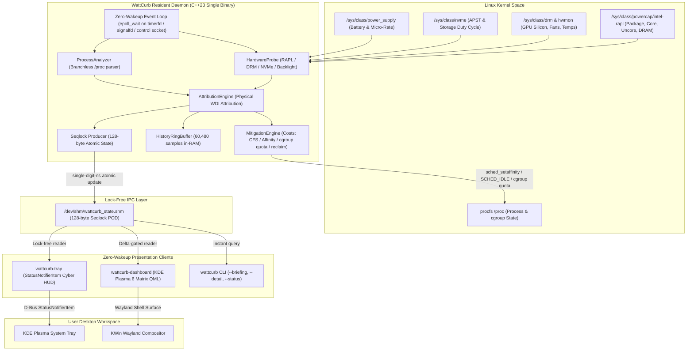

<div align="center">

# ⚡ WattCurb

### Ultra-Low-Overhead Linux Hardware Power Profiler & Autonomous Battery Preserver

**Engineered in Modern C++23 • 3-Stage Profile-Guided Optimization (PGO) • Physical Hardware RAPL/hwmon Attribution • Zero-Wakeup Event Loop • Sub-0.05% CPU & < 10 MB RSS • Native KDE Plasma 6 Cyber HUD**

---

[](https://github.com/jedclub/WattCurb/actions/workflows/ci.yml)
[](https://github.com/jedclub/WattCurb/releases)
[](https://github.com/jedclub/WattCurb/stargazers)
[](LICENSE)
[](https://en.cppreference.com/w/cpp/23)
[](docs/research/PGO_PMU_REPORT.md)
[](docs/research/PMU_BENCHMARKS.md)
[](docs/research/PMU_BENCHMARKS.md)
[](docs/architecture/ARCH-004-resident-daemon-event-loop.md)
[-ff69b4)](docs/architecture/ARCH-053-multilingual-zero-cost-l10n-architecture.md)
[](https://kernel.org)

<br/>

[Key Features](#-key-features) •
[Why WattCurb?](#-why-wattcurb-the-paradigm-shift) •
[Screenshots](#-screenshots) •
[Feature Catalog](#-feature-catalog) •
[Hardware PMU Audit](#-empirical-pmu-hardware-performance-audit) •
[Architecture](#-architecture--component-topology) •
[Quick Start](#-quick-start--installation) •
[CLI Reference](#-cli-reference) •
[FAQ](#-faq)

<br/>

<table align="center">
  <tr>
    <td align="center" width="65%">
      <b>Native KDE Plasma 6 Cyber Matrix Dashboard (Qt6 Quick/QML)</b><br/>
      
    </td>
    <td align="center" width="35%">
      <b>Desktop StatusNotifierItem Tray HUD</b><br/>
      
    </td>
  </tr>
</table>

</div>

---

## 🌟 Overview

**WattCurb** is an ultra-low-overhead, singleton Linux background power daemon built from the ground up to **maximize laptop battery runtime without degrading desktop fluidity or user experience**.

Unlike conventional power managers that rely on coarse system-wide battery drain approximations and heavy Python/shell scripts, WattCurb operates directly at the **silicon hardware level**:

- **Granular Physical Domain Attribution**: Breaks down power draw into CPU Package, Core, Uncore and DRAM (RAPL), GPU silicon duty cycle (DRM/hwmon), Display Backlight, Storage (NVMe APST) and PCIe/WiFi radio states.
- **Zero-Wakeup Architecture**: A non-polling `epoll_wait` event loop anchored on kernel `timerfd` and `signalfd`, plus a control socket for IPC — no busy loops and no periodic `sleep()` polling. The CPU keeps its deep C-state residency between coordinated wakes.
- **Progressive Non-Halting Mitigation**: Never terminates processes. Applies CFS `SCHED_IDLE` + idle I/O priority, spatial CPU-core partitioning that protects audio and the compositor, cgroup v2 **CPU quota** capping, and memory reclaim — with full state rollback on profile change or shutdown.
- **Sub-Milliwatt Daemon Footprint**: Modern C++23 with zero heap allocations on hot paths, flat cache-line-aligned data structures and a lock-free 128-byte Seqlock shared-memory IPC (`/dev/shm`).
- **Profile-Guided Optimization (PGO)**: Verified with hardware Performance Monitoring Unit (`perf stat`) counters and a 3-stage PGO + LTO pipeline.
- **Zero-Cost 14-Language Internationalization**: A compile-time translation matrix covering 14 major world languages with automatic system-locale detection and single-digit-nanosecond lookups.

> **Honest scope note:** the CLI and the tray HUD are fully translated across all 14 locales. The Qt6 dashboard's labeled telemetry keys are localized; a handful of button labels and tooltips remain Korean-only and are being migrated into the l10n matrix (see [Architecture → l10n](#-zero-cost-14-language-internationalization-l10n)).

---

## ⚡ Why WattCurb? (The Paradigm Shift)

| Capability / Architecture | Legacy Tools (TLP, auto-cpufreq, powertop) | **WattCurb Daemon & GUI Suite** |
| :--- | :--- | :--- |
| **Power Measurement Basis** | Coarse battery discharge rate or static ACPI estimates | **True physical hardware domain attribution** (RAPL Package/Cores/Uncore/DRAM, GPU, Display, NVMe APST, WiFi) |
| **Execution Architecture** | Python, Perl, or Bash scripts with periodic polling | **Pure C++23 compiled binary** with zero dynamic memory allocation on hot monitoring paths |
| **CPU Wakeup Impact** | Periodic wakeups and high syscall overhead | **Coordinated-wakeup design**: blocks in `epoll_wait` on `timerfd` / `signalfd`; no polling jitter |
| **Process Intervention** | Aggressive OOM killing or blind governor capping | **Progressive non-halting mitigation ladder** → `SCHED_IDLE`, spatial affinity, `SCHED_BATCH`, cgroup CPU quota, memory reclaim; **Zero-Kill Guarantee** |
| **Audio & Compositor Safety** | Audio stuttering or UI frame drops under throttle | **Real-time core reservation**: the audio server (PipeWire/JACK) and the KWin compositor are immune to mitigation |
| **Desktop Integration** | Terminal-only or basic static icons | **Native StatusNotifierItem (SNI) Tray HUD** + **KDE Plasma 6 Matrix Dashboard** (Qt6 Quick/QML) |
| **IPC Communication** | Heavy D-Bus method calls or JSON files on disk | **128-byte Lock-Free Seqlock POD** in `/dev/shm` (single-digit-ns reads, 0 disk I/O) |
| **Compiler Optimization** | Standard `-O2` distribution packages | **Automated 3-Stage PGO Pipeline** (`-fprofile-generate` → Training → `-fprofile-use` + LTO) |
| **Internationalization (l10n)** | English only | **Zero-cost 14-language matrix** in `.rodata` with automatic system-locale detection |

---

## 📊 Empirical PMU Hardware Performance Audit

Every optimization claim in WattCurb is anchored to hardware Performance Monitoring Unit (PMU) counters (`perf stat`). The audit below is the **M34 PGO A/B benchmark** (2026-09-20) measured on AMD Ryzen 7 PRO 4750U (Zen 2, 8C/16T) under KDE Plasma 6 Wayland.

<div align="center">
  
</div>

### 🔬 Empirical Hardware Benchmark Comparison (Normal `-O3 -flto` vs 3-Stage PGO)

| Hardware Counter / Metric | Normal Release (`-O3 -flto`) | **PGO Release (`-fprofile-use -flto`)** | Optimization Delta |
| :--- | :---: | :---: | :--- |
| **Active Loop CPU Cycles** | 7,366,847 cyc | **6,072,116 cyc** | 🟢 **-17.6% fewer CPU cycles** |
| **Instruction Throughput (IPC)** | 1.00 IPC | **1.20 IPC** | ⚡ **+20.0% ILP efficiency** |
| **Retired Instructions** | 7,380,446 | **8,289,034** | 🚀 **+12.3% productive throughput** |
| **Branch Mispredictions** | 57,421 misses | **53,718 misses** | 🛡️ **-6.4% branch misses** |
| **Full Test-Suite Cache Misses** | 2,061,342 misses | **1,556,988 misses** | 📉 **-24.5% cache misses** |
| **Tray HUD ToolTip Render Latency** | 52.0 ns | **27.0 ns** | 🚀 **1.9x faster** |
| **Hover Hysteresis Decision** | 33.2 ns | **25.4 ns** | ⚡ **23.4% faster bypass** |
| **Dashboard JSON Ingestion** | 459.2 µs/op | **353.3 µs/op** | 🚀 **23.1% faster parsing** |
| **Full Test-Suite Runtime** | 737.80 ms | **651.75 ms** | 🚀 **-11.7% faster** |
| **Host-Wide CPU Consumption** | 0.043% | **0.044%** | 🏆 **Sub-0.05% at steady state** |
| **Daemon Peak RSS** | 12.18 MB (M0) | **< 10 MB flat** | 🏆 **Zero-growth steady state** |

**Current release artifact sizes** (from the latest auto-generated [`PGO_PMU_REPORT.md`](docs/research/PGO_PMU_REPORT.md), GCC 16 `-O3 -flto=auto -march=native`, stripped):

| Binary | Size |
| :--- | ---: |
| `wattcurb` (Daemon) | ~348 KB |
| `wattcurb-tray` (Tray) | ~98 KB |
| `wattcurb-dashboard` (Dashboard) | ~255 KB |

> Complete hardware logs, `perf` command lines, milestone history and assembly analysis:
> [`docs/research/PMU_BENCHMARKS.md`](docs/research/PMU_BENCHMARKS.md) ([`REF-RES-005`](docs/research/PMU_BENCHMARKS.md)) and the auto-regenerated [`docs/research/PGO_PMU_REPORT.md`](docs/research/PGO_PMU_REPORT.md) ([`REF-RES-004`](docs/research/PGO_PMU_REPORT.md)).

---

## 📸 Screenshots

<div align="center">

**KDE Plasma 6 Matrix Dashboard** — real-time power decomposition, per-process attribution matrix, CPU C-state affinity badges and a 35 s power timeline.


<br/><br/>

**Desktop Tray HUD** — battery/power flow, wakeups/sec, fan RPM and the top drain culprit at a glance, with a 500 ms hover hysteresis to avoid wasteful re-rendering.


</div>

Want to contribute a screenshot from your own machine? Open a PR adding it under `docs/assets/` — see [Contributing](#-contributing).

---

## 🌐 Zero-Cost 14-Language Internationalization (l10n)

WattCurb ships a compile-time translation matrix for **14 major world languages** — the most spoken languages globally plus Korean and Japanese — covering over **4.6 billion native speakers**:

<div align="center">

| Code | Language | Native Name | Code | Language | Native Name |
| :---: | :---: | :---: | :---: | :---: | :---: |
| `en` | **English** | English | `ko` | **Korean** | 한국어 |
| `zh` | **Mandarin Chinese** | 简体中文 | `hi` | **Hindi** | हिन्दी |
| `es` | **Spanish** | Español | `ar` | **Arabic** | العربية |
| `bn` | **Bengali** | বাংলা | `fr` | **French** | Français |
| `ru` | **Russian** | Русский | `pt` | **Portuguese** | Português |
| `ur` | **Urdu** | اردو | `id` | **Indonesian** | Bahasa Indonesia |
| `de` | **German** | Deutsch | `ja` | **Japanese** | 日本語 |

</div>

### Mechanical Sympathy in l10n
- **0 Byte Dynamic Allocation**: translations live in a flat 2D `std::string_view` compile-time table in the ELF `.rodata` section.
- **Automatic System Locale Detection**: reads `WATTCURB_LANG`, `LC_ALL`, `LC_MESSAGES` and `LANG` at bootstrap, matches against supported ISO-639 codes, and falls back to English.
- **Single-digit-nanosecond lookups**: direct 2D matrix indexing (`[locale_idx][string_id]`); localized rendering never wakes the CPU or allocates memory.
- **Current coverage**: CLI and tray HUD are fully localized; the dashboard localizes its labeled telemetry keys, with a few button labels and tooltips still Korean-only and progressively being migrated. `WATTCURB_LANG=en` (or any supported code) forces a locale for scripting and screenshots.

---

## 🏛️ Architecture & Component Topology



---

## 🚀 Key Features

### 1. Granular Physical Domain Power Attribution
- **Intel & AMD RAPL**: Package (`package-0`), Core (`core`), Uncore (`uncore`) and DRAM (`dram`) rails sampled on the daemon's observation cadence.
- **GPU Silicon Decoupling**: decouples APU integrated-graphics power from CPU cores using hardware DRM/hwmon counters and a duty-cycle estimator.
- **Storage NVMe APST**: tracks Autonomous Power State Transitions and block I/O duty cycles so SSDs do not linger in high-power states.
- **Display Backlight & WiFi Radio**: attributes display backlight energy and active radio wakeups to the responsible applications.

### 2. Zero-Wakeup Event-Driven Loop
- Strictly adheres to the **Zero-Wakeup design principle**.
- Instead of polling loops or periodic `sleep()` calls, WattCurb blocks in `epoll_wait` anchored to a kernel `timerfd`, a `signalfd` and an IPC control socket.
- The daemon adopts an adaptive cadence (a relaxed background tick, tightening when an interactive lease is active) and keeps host-wide CPU consumption below **0.05%** on the reference 16-thread machine.

### 3. Progressive Non-Halting Mitigation Ladder
- **Tier 1 — Scheduler Demotion**: eligible background/runaway tiers move to `SCHED_IDLE` plus idle I/O priority; UltraEndurance additionally applies a positive nice bias.
- **Tier 2 — Spatial Core Partitioning**: reserves a clean headroom CPU subset for the audio server and compositor, and pins greedy compute workloads off it.
- **Tier 3 — `SCHED_BATCH` + cgroup v2 CPU quota**: caps greedy batch processes (e.g. 40% quota) and performs proactive memory reclaim.
- **Zero-Kill Guarantee**: WattCurb **never terminates processes** (`kill(pid, 0)` is used only as a liveness probe). cgroup *freezing* is deliberately disabled to preserve system stability.
- **Full-State Rollback**: on profile change or shutdown, WattCurb sweeps every tracked mitigation and restores the captured hardware baseline.

### 4. Desktop StatusNotifierItem (SNI) Tray Client (`wattcurb-tray`)
- Standalone StatusNotifierItem indicator, natively compatible with KDE Plasma, GNOME (with AppIndicator) and Wayland desktop panels.
- **500 ms Hover Hysteresis**: zero-syscall instant bypass (< 30 ns) under rapid mouse movement, avoiding wasteful rendering during casual cursor passes.
- **O(1) LUT Resolution**: color, icon-name and bar-geometry lookups without dynamic string parsing.
- Rich Cyber HUD tooltip with real-time battery drain, temperature, fan speed and the top power culprit.

### 5. Native KDE Plasma 6 Matrix Dashboard (`wattcurb-dashboard`)
- High-density btop-inspired telemetry layout built with Qt6 Quick/QML.
- Circular power-share decomposition, real-time RAPL rail meters and a historical trend line.
- Delta-gated shared-memory reads bypass rendering when power metrics are unchanged.

### 6. In-Memory Telemetry Ring Buffer
- Fixed-capacity circular buffer of **60,480 samples** (≈7 days at a 10-second cadence) held entirely in RAM.
- **Zero Disk I/O**: no disk write wear and no storage wakeups.
- Instant historical recall via `wattcurb -H / --history`.

---

## 🧩 Feature Catalog

`wattcurb --features` prints the full, rationale-annotated catalog. Eight modular optimizations ship today:

| ID | Feature | Domain | Default | Mechanism |
| :--- | :--- | :--- | :---: | :--- |
| FEAT-001 | `SchedIdleThrottle` | CPU / Scheduler | ✅ | `SCHED_IDLE` + idle I/O priority on eligible background tiers |
| FEAT-002 | `TimerSlackCoalescing` | Kernel Timers | ✅ | `PR_SET_TIMERSLACK` / `timerslack_ns` to coalesce wakeups |
| FEAT-003 | `ProactiveMemoryReclaim` | Memory / ZRAM | ✅ | `madvise(MADV_PAGEOUT)` / cgroup reclaim of inactive pages |
| FEAT-004 | `CgroupFreezer` | Cgroup | ⛔ | **Disabled by the Zero-Kill / non-halting invariant** (REF-REQ-044) |
| FEAT-005 | `ZenCcxAffinityPinning` | AMD Zen IF / CCX | ✅ | `sched_setaffinity` within one CCX to cut Infinity Fabric energy |
| FEAT-006 | `DisplayBacklightFloor` | Display Panel | ✅ | Backlight advisory cap under low-battery states |
| FEAT-007 | `PcieAspmEnforcer` | PCIe Bus | ✅ | PCIe ASPM `powersave` + NVMe APST/runtime-PM |
| FEAT-008 | `AntiStarvationHeadroom` | Scheduler / Affinity | ✅ | Headroom-core reservation + `SCHED_BATCH` for greedy batch work |

---

## 📦 Quick Start & Installation

### Option 1: Automated Release Tarball (Recommended)

Download the latest pre-compiled, PGO-optimized release from [GitHub Releases](https://github.com/jedclub/WattCurb/releases):

```bash
# Download and extract the latest release
tar -xzf wattcurb-v1.0.0-linux-x86_64.tar.gz
cd wattcurb-v1.0.0-linux-x86_64

# Run the one-shot automated installer
sudo ./install.sh
```

### Option 2: Build from Source with the Automated 3-Stage PGO Pipeline

#### Prerequisites
- **Compiler**: GCC 13+ or Clang 17+ with C++23 support
- **Build Tools**: CMake 3.28+, Ninja, `pkg-config`, `binutils`
- **System Libraries**: `libsystemd-dev`
- **GUI Libraries (optional, for tray/dashboard)**: Qt6 (`qt6-base-dev`, `qt6-declarative-dev`, `qml6-module-qtquick*`)

```bash
# Clone the repository
git clone https://github.com/jedclub/WattCurb.git
cd WattCurb

# 3-stage PGO pipeline: Instrument -> Train -> PGO + LTO -> strip & audit
# (produces output/ and regenerates docs/research/PGO_PMU_REPORT.md)
bash scripts/build_pgo.sh

# Install the hardened unit and binaries
sudo ./install.sh
```

> `install.sh` installs `scripts/wattcurb.service` **verbatim** and stages the PGO binaries from `output/`. Do not install `build/` artifacts — they are un-optimized and unstripped.

---

## 🔧 Service Management

WattCurb runs the profiler as a **root systemd service** for direct hardware/sysfs access, while the tray runs as a **user-session process** launched through XDG autostart. There is no separate user unit.

```bash
# Start and enable the root hardware profiling daemon
sudo systemctl enable --now wattcurb.service

# Check live daemon status
systemctl status wattcurb.service

# Query the daemon from any terminal
wattcurb --status
```

The tray auto-starts on login via `/etc/xdg/autostart/wattcurb-tray.desktop` (installed by `install.sh`). Launch the dashboard from your application menu (`wattcurb-dashboard`) or run `wattcurb-dashboard` directly.

---

## 💻 CLI Reference

WattCurb provides an instantaneous, low-overhead command-line interface that queries the live daemon state directly from shared memory.

```text
Usage: wattcurb [options]

Developer & Debugging Reporting:
  -b, --briefing         High-fidelity detailed executive briefing (10s observation by default)
  -R, --battery-report   Audit accumulated battery history logs & print deep drain report
      --detail           Comprehensive engineering/developer terminal table dashboard
  -F, --features         Print catalog of all modular optimization features with rationale
  -X, --extreme-profile  Execute a 30s extreme battery profile for LLM feature synthesis

Daemon & Live Modes:
  -d, --daemon           Run persistent daemon (128-byte binary Seqlock POD state in /dev/shm)
  -s, --status           Query live binary state from the running daemon via the Seqlock POD
  -H, --history          Display in-memory telemetry history (0 disk I/O)
  -L, --logs             Display recent event-driven audit logs from journald / audit.log
  -l, --live             Continuous live interactive terminal dashboard (Ctrl+C to stop)

Observation & Feature Tuning Options:
      --period <sec>     Daemon sleep period in seconds (default: 3.0s)
      --window <sec>     Daemon observation window in seconds (default: 1.0s)
  -i, --interval <sec>   Sampling interval in seconds (default: 2.0s)
  -w, --duration <sec>   Total window duration in seconds (default for briefing: 10.0s)
  -n, --top <count>      Number of top processes to display (default: 15)
      --dev-profile      Display fine-grained subsystem execution cost breakdown
  -h, --help             Display this help message and exit
```

### Live Status Query
```bash
wattcurb --status
```
```text
[WattCurb Resident Daemon Binary Status (REF-ARCH-018)]
  - Total System Drain : 14.85 W
  - CPU Package Drain  : 4.10 W (45°C)
  - GPU Silicon Drain  : 0.35 W
  - Battery Level      : 72% (Discharging)
  - System Wakeups     : 320 wakeups/sec
  - Cooling Fan        : 2800 RPM
  - Active Mitigations : 2 features active
  - Top Drain Culprit  : PID 1002 (firefox) -> 3.40 W
```

### Executive Power Briefing
```bash
wattcurb --briefing
```

### Feature Catalog
```bash
wattcurb --features
```

---

## ❓ FAQ

**Does WattCurb kill my processes?**
No. It has a hard **Zero-Kill Guarantee**. `kill(pid, 0)` is used purely as a liveness probe, and cgroup *freezing* is deliberately disabled.

**Will it fight `power-profiles-daemon` or TLP?**
WattCurb detects competing managers that own `platform_profile` and refuses to write it while they hold it, logging a clear conflict alert instead. For full control, mask the competitor (`systemctl mask --now power-profiles-daemon`).

**Does it work on desktops without a battery?**
Yes. Attribution and mitigation still apply; battery-specific features simply elide when no battery is present.

**Is my data uploaded anywhere?**
No. All telemetry stays in RAM and in `/dev/shm`. Nothing leaves the machine.

**Why is the dashboard partly in Korean?**
The CLI and tray are fully localized in 13 languages. The dashboard's labeled telemetry keys are localized, but a few button labels and tooltip strings are still Korean-only and are being migrated into the l10n matrix.

---

## 🤝 Contributing

- Follow the repository's `AGENTS.md` conventions (documentation-driven, Ref-ID indexed, Korean commit messages).
- Every change should keep the "Oracle Gate" test suite green: `python3 scripts/harness.py eval`.
- Report issues at <https://github.com/jedclub/WattCurb/issues>.

If WattCurb saves you battery, consider giving it a ⭐ — it helps others find it.

---

## 🏷️ Discovery Topics & SEO Tags

`power-management` • `battery-saver` • `linux-daemon` • `cpp23` • `profile-guided-optimization` • `pgo` • `kde-plasma-6` • `rapl-profiler` • `system-tray` • `status-notifier-item` • `zero-overhead` • `zero-wakeup` • `nvme-apst` • `hwmon` • `low-power` • `seqlock` • `performance-monitoring` • `cyberpunk-hud`

---

## 📄 License

This project is licensed under the **MIT License** — see the [LICENSE](LICENSE) file for details.
