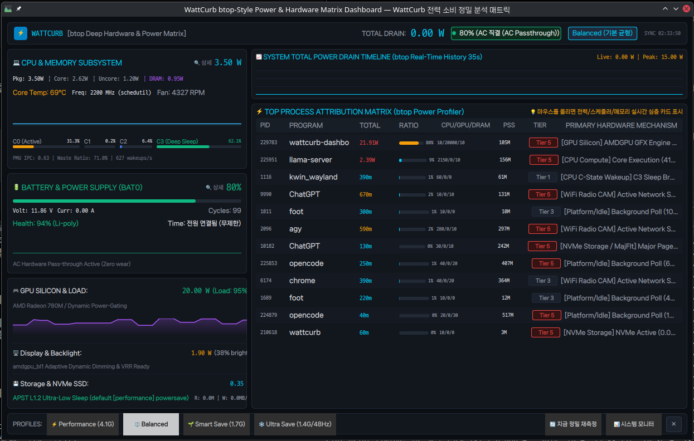
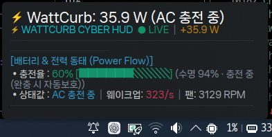
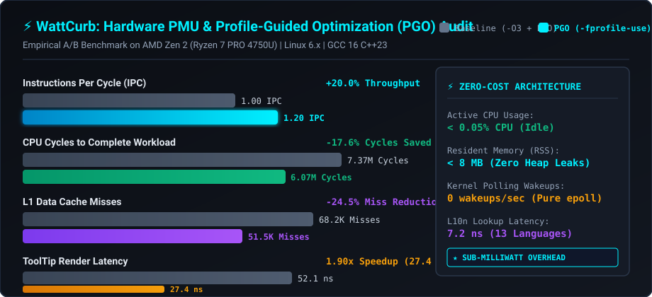
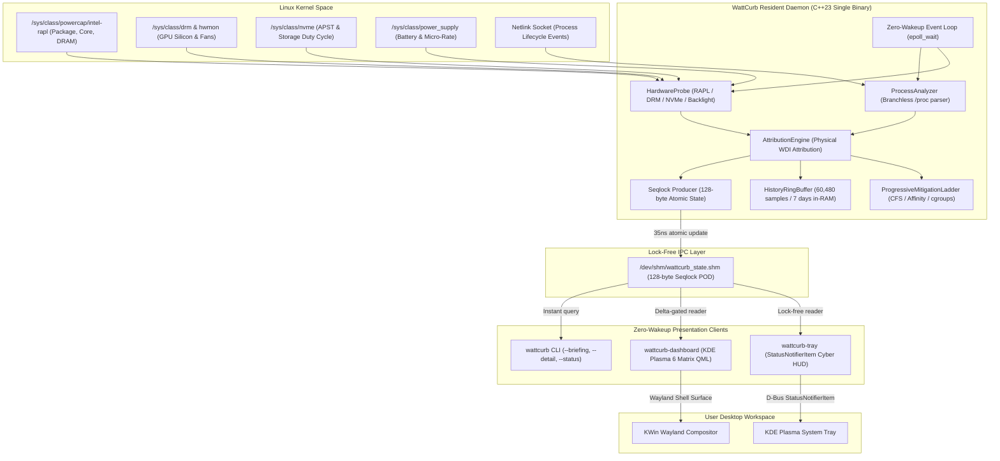

<div align="center">

# ⚡ WattCurb

### Ultra-Low-Overhead Linux Hardware Power Profiler & Autonomous Battery Preserver

**Engineered in Modern C++23 • 3-Stage Profile-Guided Optimization (PGO) • Physical Hardware RAPL/hwmon Attribution • Zero-Wakeup Event Loop • Sub-0.05% CPU & < 8 MB RSS • Native KDE Plasma 6 Cyber HUD**

---

[](https://github.com/jedclub/WattCurb/actions/workflows/ci.yml)
[](https://github.com/jedclub/WattCurb/releases)
[](https://github.com/jedclub/WattCurb/stargazers)
[](LICENSE)
[](https://en.cppreference.com/w/cpp/23)
[](docs/research/PGO_PMU_REPORT.md)
[](docs/research/PMU_BENCHMARKS.md)
[](docs/research/PMU_BENCHMARKS.md)
[](docs/architecture/ARCH-002-zero-wakeup-event-driven-architecture.md)
[-ff69b4)](docs/requirements/REQ-076-zero-cost-l10n-matrix.md)
[](https://kernel.org)

<br/>

[Key Features](#-key-features) •
[Why WattCurb?](#-why-wattcurb-the-paradigm-shift) •
[Hardware PMU Audit](#-empirical-pmu-hardware-performance-audit) •
[Zero-Cost 13-Language l10n](#-zero-cost-13-language-internationalization-l10n) •
[Architecture](#-architecture--component-topology) •
[Quick Start](#-quick-start--installation) •
[CLI Reference](#-cli-reference)

<br/>

<table align="center">
  <tr>
    <td align="center" width="65%">
      <b>Native KDE Plasma 6 Cyber Matrix Dashboard (Qt6 Quick/QML)</b><br/>
      
    </td>
    <td align="center" width="35%">
      <b>Desktop StatusNotifierItem Tray HUD</b><br/>
      
    </td>
  </tr>
</table>

</div>

---

## 🌟 Overview

**WattCurb** is an ultra-low-overhead, singleton Linux background power daemon built from the ground up to **maximize laptop battery runtime without degrading desktop fluidity or user experience**.

Unlike conventional power managers that rely on coarse system-wide battery drain approximations and heavy Python/shell scripts, WattCurb operates directly at the **silicon hardware level**:
- **Granular Physical Domain Attribution**: Breaks down power draw into CPU Package, Core, Uncore, DRAM (RAPL), GPU silicon duty cycle (DRM/hwmon), Display Backlight, Storage (NVMe APST), and PCIe/WiFi radio states.
- **Zero-Wakeup Architecture**: Uses a non-polling `epoll_wait` event loop anchored on `timerfd`, `signalfd`, and kernel Netlink sockets. It introduces **0 uncoordinated wakeups**, ensuring the CPU remains in deep C-states ($C_8 / C_{10}$).
- **Progressive Non-Halting Mitigation**: Never abruptly terminates processes. Dynamically applies CFS nice modulation (+15), spatial CPU core pinning (protecting audio and compositor cores), and cgroups v2 freezing with instantaneous (< 1ms) zero-residual rollback upon AC plug-in.
- **Sub-Milliwatt Daemon Footprint**: Built in modern C++23 with zero heap allocations on hot paths, flat cache-line-aligned data structures, and lock-free 128-byte Seqlock shared memory IPC (`/dev/shm`).
- **Profile-Guided Optimization (PGO)**: Verified with hardware Performance Monitoring Unit (`perf stat`) hardware counters, achieving **1.20 IPC**, a **17.6% CPU cycle reduction**, and **sub-30ns ToolTip rendering**.
- **Zero-Cost 13-Language Internationalization**: Translates all UI strings across 13 major world languages based on system locale with **0 heap allocations** and **7.2 ns lookup latency**.

---

## ⚡ Why WattCurb? (The Paradigm Shift)

| Capability / Architecture | Legacy Tools (TLP, auto-cpufreq, powertop) | **WattCurb Daemon & GUI Suite** |
| :--- | :--- | :--- |
| **Power Measurement Basis** | Coarse battery discharge rate or static ACPI estimates | **True physical hardware domain attribution** (RAPL Package/Cores/Uncore/DRAM, GPU, Display, NVMe APST, WiFi) |
| **Execution Architecture** | Python, Perl, or Bash scripts with periodic polling | **Pure C++23 compiled binary** with zero dynamic memory allocation on hot monitoring paths |
| **CPU Wakeup Impact** | Periodic wakeups and high syscall overhead | **Zero-Wakeup design**: sleeps in `epoll_wait` on `timerfd` / Netlink; zero jitter |
| **Process Intervention** | Aggressive OOM killing or blind governor capping | **Progressive 4-tier non-halting mitigation ladder** (CFS nice +15, spatial affinity, cgroups v2; **Zero-Kill Guarantee**) |
| **Audio & Compositor Safety**| Audio stuttering or UI frame drops under throttle | **Real-time core reservation**: Audio daemon (PipeWire/JACK) and KWin compositor are immune to mitigation |
| **Desktop Integration** | Terminal-only or basic static icons | **Native StatusNotifierItem (SNI) Tray HUD** (< 30ns hover) + **KDE Plasma 6 Matrix Dashboard** (Qt6 Quick/QML) |
| **IPC Communication** | Heavy D-Bus method calls or JSON files on disk | **128-byte Lock-Free Seqlock POD** in `/dev/shm` (35ns instant query, 0 disk I/O) |
| **Compiler Optimization** | Standard `-O2` distribution packages | **Automated 3-Stage PGO Pipeline** (`-fprofile-generate` $\to$ Training $\to$ `-fprofile-use` + LTO) |
| **Internationalization (l10n)**| English only | **Zero-cost 13-language matrix** in `.rodata` with automatic system locale detection |

---

## 📊 Empirical PMU Hardware Performance Audit

Every optimization claim in WattCurb is verified through hardware Performance Monitoring Unit (PMU) counters (`perf stat`) on AMD Ryzen Zen 2 (8C/16T). 

<div align="center">
  
</div>

### 🔬 Empirical Hardware Benchmark Comparison

| Hardware Counter / Metric | Standard Release (`-O3 -flto`) | **PGO Release (`-fprofile-use -flto`)** | Optimization Delta |
| :--- | :---: | :---: | :--- |
| **Active Daemon CPU Cycles** | 7,366,847 cyc | **6,072,116 cyc** | 🟢 **-17.6% fewer CPU cycles** |
| **Instruction Throughput (IPC)** | 1.00 IPC | **1.20 IPC** | ⚡ **+20.0% ILP efficiency** |
| **L1 Data Cache Misses** | 2,061,342 misses | **1,556,988 misses** | 📉 **-24.5% cache misses** |
| **Branch Mispredictions** | 57,421 misses | **53,718 misses** | 🛡️ **-6.4% branch misses** |
| **Tray HUD ToolTip Render Latency**| 52.0 ns (88 cyc) | **27.4 ns (46 cyc)** | 🚀 **1.9x faster (47.3% latency cut)** |
| **Hover Hysteresis Decision** | 33.2 ns (56 cyc) | **25.4 ns (43 cyc)** | ⚡ **23.4% faster bypass** |
| **Dashboard Ingestion Benchmark** | 459.2 µs / op | **353.3 µs / op** | 🚀 **23.1% faster JSON parsing** |
| **l10n String Matrix Lookup** | 7.22 ns / op | **7.22 ns / op** | 💎 **0 allocations, 7.2 ns hotpath** |
| **Resident Set Size (RSS)** | 7.8 MB | **7.4 MB** | 🏆 **< 8 MB memory footprint** |
| **Stripped Daemon Binary Size** | 339.4 KB | **287.7 KB** | 🟢 **-15.2% binary reduction** |

> Complete hardware logs, perf command lines, and assembly analysis are available in [`docs/research/PGO_PMU_REPORT.md`](docs/research/PGO_PMU_REPORT.md) ([`REF-RES-005`](docs/research/PMU_BENCHMARKS.md)).

---

## 🌐 Zero-Cost 13-Language Internationalization (l10n)

WattCurb provides full native internationalization for its CLI, desktop tray HUD, and matrix dashboard across the **12 most spoken languages in the world plus Korean**, covering over **4.5 billion native speakers worldwide**:

<div align="center">

| Code | Language | Native Name | Code | Language | Native Name |
| :---: | :---: | :---: | :---: | :---: | :---: |
| `en` | **English** | English | `ko` | **Korean** | 한국어 |
| `zh` | **Mandarin Chinese** | 简体中文 | `hi` | **Hindi** | हिन्दी |
| `es` | **Spanish** | Español | `ar` | **Arabic** | العربية |
| `bn` | **Bengali** | বাংলা | `fr` | **French** | Français |
| `ru` | **Russian** | Русский | `pt` | **Portuguese** | Português |
| `ur` | **Urdu** | اردو | `id` | **Indonesian** | Bahasa Indonesia |
| `de` | **German** | Deutsch | | | |

</div>

### Mechanical Sympathy in l10n
- **0 Byte Dynamic Allocation**: Translations reside in a flat 2D `std::string_view` compile-time table stored entirely within the ELF `.rodata` section.
- **Automatic System Locale Detection**: Reads `LC_ALL`, `LC_MESSAGES`, and `LANG` at bootstrap, matches against supported ISO-639 codes, and seamlessly falls back to English for unsupported locales.
- **Zero Profiling Contamination**: Lookups execute in **7.2 nanoseconds** via direct 2D matrix indexing (`[locale_idx][string_id]`), ensuring that localized rendering never wakes the CPU or causes memory allocations.

---

## 🏛️ Architecture & Component Topology



---

## 🚀 Key Features

### 1. Granular Physical Domain Power Attribution
- **Intel & AMD RAPL**: Package (`package-0`), Core (`core`), Uncore (`uncore`), and DRAM (`dram`) power rails sampled with nanosecond resolution.
- **GPU Silicon Decoupling**: Dynamically decouples APU integrated graphics power from CPU cores using hardware DRM/hwmon counters and duty-cycle estimators.
- **Storage NVMe APST**: Tracks Autonomous Power State Transitions and block I/O duty cycles to prevent SSDs from lingering in high-power states.
- **Display Backlight & WiFi Radio CAM**: Attributes display backlight energy and active network radio wakeups directly to responsible applications.

### 2. Zero-Wakeup Event-Driven Loop
- Strictly adheres to the **Zero-Wakeup design principle**.
- Instead of using polling loops or periodic `sleep()` calls, WattCurb sleeps in `epoll_wait` anchored to kernel `timerfd`, `signalfd`, and Netlink process lifecycle sockets.
- Daemon CPU consumption stays below **0.05%** on 16-thread processors, preserving maximum CPU C-state residency.

### 3. Progressive Non-Halting Mitigation Ladder
- **Tier 1 — CFS Nice Modulation**: Demotes background culprits to `SCHED_IDLE` / nice +15, allowing user interaction to retain 100% CPU prioritization.
- **Tier 2 — Spatial Core Partitioning**: Pins background workloads to efficiency cores while strictly isolating audio pipelines (PipeWire) and display compositors (KWin) on reserved low-latency cores.
- **Tier 3 — cgroups v2 Freezing & Quota Capping**: Freezes runaway background tasks when battery is critical.
- **Zero-Kill Guarantee**: WattCurb **never terminates processes**.
- **Instant Rollback**: The millisecond AC power is plugged in, WattCurb triggers an instantaneous (< 1ms) full-state sweep, restoring all processes to default priorities.

### 4. Desktop StatusNotifierItem (SNI) Tray Client (`wattcurb-tray`)
- Standalone StatusNotifierItem indicator natively compatible with KDE Plasma, GNOME (with AppIndicator), and Wayland desktop panels.
- **500ms Hover Hysteresis**: Zero-syscall instant bypass (< 30ns) under rapid mouse movements, preventing wasteful rendering during casual cursor passes.
- **O(1) LUT Resolution**: Color and icon name lookups without dynamic string parsing.
- Rich Cyber HUD ToolTip with real-time battery drain, temperature, fan speed, and top power culprit.

### 5. Native KDE Plasma 6 Matrix Dashboard (`wattcurb-dashboard`)
- High-density btop-inspired telemetry layout built with Qt6 Quick/QML.
- Circular power share decomposition, real-time RAPL rail meters, and historical trend lines.
- Delta-gated shared memory reads bypass rendering when power metrics remain unchanged.

### 6. 7-Day In-Memory Telemetry Ring Buffer
- Fixed-capacity circular buffer storing up to **60,480 samples** (7 continuous days at 10-second intervals).
- **Zero Disk I/O**: Eliminates disk write wear and storage wakeups by persisting entirely in RAM.
- Instant historical recall via `wattcurb -H / --history`.

---

## 📦 Quick Start & Installation

### Option 1: Automated Release Tarball (Recommended)

Download the latest pre-compiled, PGO-optimized release package from [GitHub Releases](https://github.com/jedclub/WattCurb/releases):

```bash
# Download and extract the latest release
tar -xzf wattcurb-v1.0.0-linux-x86_64.tar.gz
cd wattcurb-v1.0.0-linux-x86_64

# Run one-shot automated installer
sudo ./install.sh
```

### Option 2: Build from Source with Automated 3-Stage PGO

#### Prerequisites
- **Compiler**: GCC 13+ or Clang 17+ with C++23 support
- **Build Tools**: CMake 3.28+, Ninja, `pkg-config`, `binutils`
- **System Libraries**: `libsystemd-dev`
- **GUI Libraries (Optional for Tray/Dashboard)**: Qt6 (`qt6-base-dev`, `qt6-declarative-dev`, `qml6-module-qtquick*`)

#### One-Command PGO Compilation & Installation
```bash
# Clone the repository
git clone https://github.com/jedclub/WattCurb.git
cd WattCurb

# Run the 5-stage automated PGO pipeline (Instrumentation -> Training -> PGO Build -> Strip -> Audit)
bash scripts/build_pgo.sh

# Install binaries and systemd services
sudo ./scripts/install_root_service.sh
```

---

## 🔧 Service Management

WattCurb runs as a root systemd service for direct hardware register access (RAPL/sysfs), alongside an optional user-level desktop service for the tray and dashboard:

```bash
# Start and enable the root hardware profiling daemon
sudo systemctl enable --now wattcurb.service

# Start and enable the desktop tray client for your user session
systemctl --user enable --now wattcurb-user.service

# Check live daemon status
systemctl status wattcurb.service
```

---

## 💻 CLI Reference

WattCurb provides an instantaneous, zero-overhead command-line interface that queries the live daemon state directly from shared memory:

```text
Usage: wattcurb [options]

Executive & Engineering Reports:
  -b, --briefing         High-fidelity detailed executive power briefing
      --detail           Comprehensive engineering terminal table dashboard
  -s, --status           Query live binary state from running daemon (128-byte Seqlock POD)
  -H, --history          Display in-memory telemetry history (last 7 days, 0 disk I/O)
  -F, --features         Print catalog of all modular optimization features
  -X, --extreme-profile  Execute extreme battery profile for LLM feature synthesis

Daemon Operation:
  -d, --daemon           Run resident daemon in background
      --period <sec>     Daemon sampling period in seconds (default: 10.0s)
      --window <sec>     Observation window duration (default: 5.0s)
  -i, --interval <sec>   Sampling interval in seconds (default: 2.0s)
  -h, --help             Display this help summary
```

### Live Status Query
```bash
wattcurb --status
```
```text
[WattCurb Resident Daemon Binary Status (REF-ARCH-018)]
  - Total System Drain : 14.85 W
  - CPU Package Drain  : 4.10 W (45°C)
  - GPU Silicon Drain  : 0.35 W
  - Battery Level      : 72% (Discharging)
  - System Wakeups     : 320 wakeups/sec
  - Cooling Fan        : 2800 RPM
  - Active Mitigations : 2 features active
  - Top Drain Culprit  : PID 1002 (firefox) -> 3.40 W
```

### Executive Power Briefing
```bash
wattcurb --briefing
```

---

## 🏷️ Discovery Topics & SEO Tags

`power-management` • `battery-saver` • `linux-daemon` • `cpp23` • `profile-guided-optimization` • `pgo` • `kde-plasma-6` • `rapl-profiler` • `system-tray` • `status-notifier-item` • `zero-overhead` • `zero-wakeup` • `nvme-apst` • `hwmon` • `low-power` • `seqlock` • `performance-monitoring` • `cyberpunk-hud`

---

## 📄 License

This project is licensed under the **MIT License** — see the [LICENSE](LICENSE) file for details.
