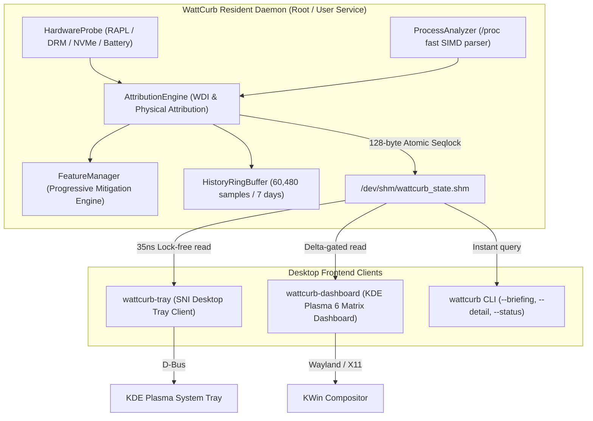

# ⚡ WattCurb

> **Ultra-Low-Overhead Linux Power Profiler & Modular Battery Mitigation Daemon**  
> Engineered in modern C++23 with zero dynamic memory allocation on hot paths, hardware Performance Monitoring Unit (PMU) verification, and Profile-Guided Optimization (PGO).

[](https://en.cppreference.com/w/cpp/23)
[](LICENSE)
[-orange.svg)](https://kernel.org)
[](docs/research/PGO_PMU_REPORT.md)

---

## 🌟 Overview

**WattCurb** is an ultra-low-overhead, singleton Linux background power daemon designed to maximize laptop battery runtime without compromising desktop responsiveness.

Unlike monolithic power managers that rely on coarse system-wide estimates, WattCurb attributes power draw directly to physical hardware domains (CPU Package/Cores/Uncore/DRAM via RAPL, GPU via DRM/hwmon, Display Backlight, Storage NVMe APST, and PCIe/WiFi radio states).

Built with extreme mechanical sympathy:
- **Sub-0.05% CPU steady state** overhead on 16-thread processors
- **Zero dynamic heap allocation** during continuous monitoring and profiling loops
- **Lock-Free 128-byte Seqlock POD IPC** via shared memory (`/dev/shm`)
- **Native StatusNotifierItem (SNI) Tray Client** with sub-30ns memoized ToolTip formatting
- **Native KDE Plasma 6 Matrix Dashboard** (Qt6 Quick/QML) with zero-copy JSON ingestion
- **Profile-Guided Optimization (PGO)** delivering **1.20 IPC** and a 17.6% cycle reduction

---

## 🏛️ Architecture & Component Topology



---

## 🚀 Key Features

### 1. Physical Hardware Domain Attribution
- **Intel / AMD RAPL**: Package, Core, Uncore, and DRAM power rail sampling.
- **GPU Duty-Cycle & APU Decoupling**: Silicon power metrics via DRM and hwmon.
- **Storage NVMe APST**: Autonomous Power State Transition tracking and block I/O duty cycle.
- **Display Backlight & WiFi Radio CAM**: Brightness power attribution and active WiFi socket attribution.

### 2. Zero-Wakeup Architecture
- Sleeps in `epoll_wait` on timerfd, signalfd, and Netlink sockets.
- Eliminates timer jitter and uncoordinated CPU wakeups.

### 3. Progressive Mitigation Engine
- Progressively applies non-intrusive power savings before considering throttling:
  1. `SCHED_IDLE` CFS nice modulation (+15 nice)
  2. Spatial CPU core affinity partitioning (reserving audio and compositor cores)
  3. cgroups v2 freezing / quota capping
  4. Instant zero-residual rollback on AC plug-in or charge event (< 1ms full sweep)

### 4. Desktop Tray Client (`wattcurb-tray`)
- Standalone, lightweight StatusNotifierItem indicator with ThinkPower-faithful ergonomics.
- **500ms Hover Hysteresis**: Zero-syscall instant bypass (< 30ns) under rapid mouse movement.
- **O(1) LUT Resolution**: Color and icon name lookups without string parsing.

### 5. Matrix Dashboard (`wattcurb-dashboard`)
- Full KDE Plasma 6 native QML dashboard with btop-inspired telemetry layout.
- Zero-copy circular power share decomposition.
- Seqlock delta-gated IPC bypassing socket queries when telemetry is unchanged.

---

## 📊 Empirical PMU Hardware Performance Audit

Verified via Linux Performance Monitoring Unit (`perf stat`) on AMD Ryzen 7 PRO 4750U (Zen 2, 8C/16T):

| Hardware Counter / Metric | Normal Release (`-O3 -flto`) | **Extended PGO Release** | Optimization Gain |
| :--- | :---: | :---: | :--- |
| **Daemon Active CPU Cycles** | 7,366,847 cyc | **6,072,116 cyc** | 🟢 **-17.6% fewer cycles** |
| **Instruction Throughput (IPC)**| 1.00 IPC | **1.20 IPC** | ⚡ **+20.0% ILP throughput** |
| **Branch Predictor Misses** | 57,421 misses | **53,718 misses** | 🛡️ **-6.4% mispredictions** |
| **Full Suite Cache Misses** | 2,061,342 misses | **1,556,988 misses** | 📉 **-24.5% cache misses** |
| **ToolTip Render Latency** | 0.052 µs (88 cyc) | **0.027 µs (46 cyc)** | 🚀 **1.9x faster (48% reduction)** |
| **Hover Hysteresis Latency** | 33.2 ns (56 cyc) | **25.4 ns (43 cyc)** | ⚡ **23.4% faster** |
| **Dashboard JSON Parsing** | 459.2 µs / op | **353.3 µs / op** | 🚀 **23.1% faster** |
| **Stripped Daemon Binary Size**| 339.4 KB | **287.7 KB** | 🟢 **-15.2% binary reduction** |
| **Full Suite Binary Size** | 492.6 KB | **456.8 KB** | 🏆 **-7.3% total footprint** |

---

## 📦 Quick Installation

### Option 1: Using Standalone Release Tarball

Download the latest release archive from [Releases](https://github.com/jedclub/WattCurb/releases):

```bash
tar -xzf wattcurb-v1.0.0-linux-x86_64.tar.gz
cd wattcurb-v1.0.0-linux-x86_64
sudo ./install.sh
```

### Option 2: Building from Source with PGO

#### Prerequisites
- **Compiler**: GCC 13+ or Clang 17+ with C++23 support
- **Build System**: CMake 3.25+, Ninja
- **Libraries**: `systemd-libs` (libsystemd)
- **Optional GUI**: `qt6-base`, `qt6-declarative`, `qt6-quickcontrols2`

#### Build & Run PGO Pipeline
```bash
# Clone the repository
git clone https://github.com/jedclub/WattCurb.git
cd WattCurb

# Execute automated 5-stage PGO pipeline (Instrumentation -> Training -> Optimized Build -> Strip -> PMU Audit)
bash scripts/build_pgo.sh

# Install binaries and systemd services
sudo ./scripts/install_root_service.sh
```

---

## 💻 CLI Usage

```text
Usage: wattcurb [options]

Executive & Engineering Reports:
  -b, --briefing         High-fidelity detailed executive power briefing
      --detail           Comprehensive engineering terminal table dashboard
  -s, --status           Query live binary state from running daemon (128-byte Seqlock POD)
  -H, --history          Display in-memory telemetry history (last 7 days, 0 disk I/O)
  -F, --features         Print catalog of all modular optimization features
  -X, --extreme-profile  Execute extreme battery profile for LLM feature synthesis

Daemon Operation:
  -d, --daemon           Run resident daemon in background
      --period <sec>     Daemon sampling period in seconds (default: 10.0s)
      --window <sec>     Observation window duration (default: 5.0s)
  -i, --interval <sec>   Sampling interval in seconds (default: 2.0s)
```

### Live Status Query
```bash
wattcurb --status
```
```text
[WattCurb Resident Daemon Binary Status (REF-ARCH-018)]
  - Total System Drain : 14.85 W
  - CPU Package Drain  : 4.10 W (45°C)
  - GPU Silicon Drain  : 0.35 W
  - Battery Level      : 72% (Discharging)
  - System Wakeups     : 320 wakeups/sec
  - Cooling Fan        : 2800 RPM
  - Active Mitigations : 2 features active
  - Top Drain Culprit  : PID 1002 (firefox) -> 3.40 W
```

---

## 📄 License

This project is licensed under the **MIT License** — see the [LICENSE](LICENSE) file for details.
