# [REF-ARCH-005] C++23 Zero-Cost CPUID Query & Constant-Branch Specialization Architecture

- **Ref-ID**: `REF-ARCH-005`
- **Related Requirements**: [`REF-REQ-006`](file:///home/jedclub/Develop/WattCurb/docs/requirements/REQ-003-pgo-pmu-optimization.md), [`REF-REQ-008`](file:///home/jedclub/Develop/WattCurb/docs/requirements/REQ-005-zero-residue-release.md), [`REF-REQ-009`](file:///home/jedclub/Develop/WattCurb/docs/requirements/REQ-006-cpuid-simd-optimization.md)
- **Related Research**: [`REF-RES-004`](file:///home/jedclub/Develop/WattCurb/docs/research/PGO_PMU_REPORT.md), [`REF-RES-005`](file:///home/jedclub/Develop/WattCurb/docs/research/PMU_BENCHMARKS.md)
- **Status**: Approved

---

## 1. Architectural Philosophy: Zero-Cost CPUID Abstraction

Traditional hardware specialization relies on runtime `if (has_feature)` branching inside monitoring loops. In tight profiling loops iterating across hundreds of processes, repeated branching degrades instruction cache efficiency, causes branch target buffer (BTB) thrashing, and stalls execution pipelines.

**WattCurb eliminates runtime feature branching using C++23 Zero-Cost Abstractions**:

```mermaid
flowchart TD
    subgraph CompileTime["Compile-Time Specialization (-march=native)"]
        CT_Macros["Compiler Predefined Macros (__AVX2__, __CLZERO__, __RDPID__, __BMI2__)"]
        CT_Consteval["consteval CpuFeatureMask get_compile_time_features()"]
        CT_IfConstexpr["if constexpr (has_compile_time<Feature>())"]
        CT_ASM["Direct Inline Machine Instructions (clzero, rdpid, vpcmpeqb) - ZERO Branch Cost"]
        CT_Macros --> CT_Consteval --> CT_IfConstexpr --> CT_ASM
    end

    subgraph RuntimeNTTP["Generic Binary Fallback: NTTP Profile Specialization"]
        RT_CPUID["1-Time Bootstrap CPUID Query at Daemon Startup"]
        RT_Switch["Single Dispatch Switch (main / bootstrap)"]
        RT_Template["Template Worker: run_worker<HardwareProfile>()"]
        RT_Constexpr["Internal Branches evaluated via if constexpr (NTTP Bitmask)"]
        RT_CPUID --> RT_Switch --> RT_Template --> RT_Constexpr
    end
```



---

## 2. Core Architectural Components

### 2.1 Enumerated Feature Bitmask (`CpuFeature`)
All x86-64 microarchitectural features are represented as a 64-bit enum bitmask:
- `AVX`, `AVX2`, `FMA` (256-bit floating/integer SIMD)
- `BMI1`, `BMI2` (Bit manipulation: `tzcnt`, `lzcnt`, `pext`, `pdep`)
- `POPCNT` (Hardware Hamming weight)
- `CLZERO` (AMD Zen cache line zeroing: 64 bytes in 1 op)
- `RDPID` (User-space core ID query in 1 cycle)
- `RDTSCP` (Serialization-free cycle timestamp + core ID)
- `ERMS` (Enhanced REP MOVSB string microcode)
- `AVX512F` (512-bit vector processing)
- `MOVBE` (Single-cycle endian byte swap)

### 2.2 Compile-Time Constant Branching (`consteval` & `if constexpr`)
When compiled with `-march=native`, the C++23 compiler evaluates feature availability at compile time:
```cpp
template <CpuFeature Feat>
consteval bool has_compile_time() noexcept {
    return (static_cast<uint64_t>(get_compile_time_features()) & static_cast<uint64_t>(Feat)) != 0;
}
```
Any conditional check written as:
```cpp
if constexpr (has_compile_time<CpuFeature::CLZERO>()) {
    _mm_clzero(buf);
} else {
    std::memset(buf, 0, 64);
}
```
results in the non-applicable branch being completely eliminated by the compiler during frontend AST parsing. **Zero branch instructions, zero memory loads, and zero instruction cache pollution.**

### 2.3 Non-Type Template Parameter (NTTP) Hardware Profiles
For generic binaries without native compilation, the daemon selects an NTTP hardware profile once at startup:
```cpp
template <CpuFeatureMask Profile>
void execute_monitoring_pass(...) {
    if constexpr ((static_cast<uint64_t>(Profile) & static_cast<uint64_t>(CpuFeature::CLZERO)) != 0) {
        asm volatile("clzero" : : "a"(buf) : "memory");
    } else {
        std::memset(buf, 0, 64);
    }
}
```
The compiler emits a dedicated, branchless machine code instantiation for each profile.

---

## 3. Hardware Feature Bindings for AMD Zen 2 Host

On the host AMD Ryzen 7 PRO 4750U (Zen 2) processor, the following hardware instructions are directly emitted:

1. **`clear_cacheline_64(void* ptr)` $\rightarrow$ `clzero`**:
   Clears 64 bytes of aligned buffer memory in a single cycle without store-buffer stalling or cache evictions.
2. **`read_hardware_core_id()` $\rightarrow$ `rdpid %reg`**:
   Retrieves the current execution core in 1 CPU cycle without entering the kernel via `sched_getcpu()`.
3. **`read_hardware_tsc()` $\rightarrow$ `rdtscp`**:
   Reads nanosecond-accurate CPU cycles without pipeline serialization penalty.
4. **`find_char_fast()` & `skip_whitespace_simd()` $\rightarrow$ `vmovdqa` + `vpcmpeqb` + `vpmovmskb` + `vtzcnt`**:
   Scans 32 bytes of procfs text per instruction with single-cycle trailing zero count resolution.
