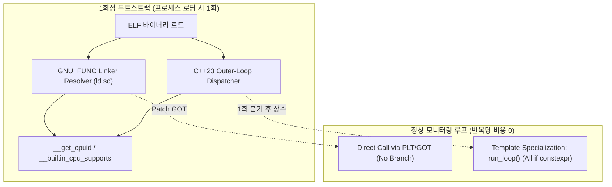

# [REF-ARCH-006] Pre-Built Binary Distribution: Zero-Overhead Hardware Specialization Architecture

- **Ref-ID**: `REF-ARCH-006`
- **Related Requirements**: [`REF-REQ-006`](file:///home/jedclub/Develop/WattCurb/docs/requirements/REQ-003-pgo-pmu-optimization.md), [`REF-REQ-008`](file:///home/jedclub/Develop/WattCurb/docs/requirements/REQ-005-zero-residue-release.md), [`REF-REQ-009`](file:///home/jedclub/Develop/WattCurb/docs/requirements/REQ-006-cpuid-simd-optimization.md)
- **Related Architecture**: [`REF-ARCH-003`](file:///home/jedclub/Develop/WattCurb/docs/architecture/ARCH-003-pgo-pmu-pipeline.md), [`REF-ARCH-005`](file:///home/jedclub/Develop/WattCurb/docs/architecture/ARCH-005-zero-cost-cpuid-simd.md)
- **Status**: Approved

---

## 1. The Core Challenge: Portable Binaries vs. Hot-Loop Branch Tax

When distributing pre-compiled binary packages (e.g. `.deb`, `.rpm`, or standalone ELF executables), binaries cannot be compiled exclusively with host-locked `-march=native`. The binary must run across diverse consumer CPUs:
- Legacy x86-64-v2 (SSE4.2, Nehalem/Bulldozer)
- x86-64-v3 (AVX2, BMI1/2, Haswell, Zen 1/2/3)
- x86-64-v4 (AVX-512, Skylake-X, Zen 4)
- CPU-specific extensions (`clzero` on AMD Zen, `rdpid` on modern Intel/AMD)

### The Anti-Pattern: Inner-Loop Runtime Branching
Checking CPU capabilities inside the monitoring loop:
```cpp
// ANTI-PATTERN: Burns CPU cycles and thrashes Branch Target Buffer (BTB)
void parse_sample(...) {
    if (cpu_has_avx2) { ... }
    if (cpu_has_clzero) { ... }
}
```
In a daemon parsing thousands of lines every second, evaluating branches repeatedly causes CPU pipeline stalls, branch misses, and wastes battery energy.

---

## 2. The Solution: Triple-Tier Zero-Overhead Dispatch

WattCurb resolves hardware specialization in pre-built binaries without **any** runtime branch penalty in hot loops using three complementary mechanisms:



---

## 3. Detailed Mechanism Specifications

### 3.1 Tier 1: GNU IFUNC (Indirect Functions) for Micro-Routines
For discrete leaf routines (e.g., SIMD delimiter scanning, cacheline clearing):
- **Mechanism**: The GNU dynamic linker (`ld.so`) executes an IFUNC resolver function **before `main()` starts**.
- **Relocation**: The linker writes the address of the selected hardware implementation directly into the GOT.
- **Runtime Cost**: Subsequent calls jump directly to the target machine code with **zero condition checks and zero branch instructions**.
- **Example Implementation**:
  ```cpp
  typedef const char* (*FindCharFn)(const char*, const char*, char);

  extern "C" FindCharFn resolve_find_char() {
      __builtin_cpu_init();
      if (__builtin_cpu_supports("avx2")) {
          return &find_char_avx2;
      }
      return &find_char_scalar;
  }

  const char* find_char_simd(const char* s, const char* e, char c) 
      __attribute__((ifunc("resolve_find_char")));
  ```

---

### 3.2 Tier 2: C++23 NTTP Outer-Loop Specialization for Monolithic Engines
For complex execution loops (e.g., `ProcessAnalyzer::capture_active_processes`, `AttributionEngine::compute_attribution`) where indirect function calls would inhibit compiler inlining:
- **Mechanism**: The entire monitoring loop is parameterized by a `HardwareProfile` Non-Type Template Parameter (NTTP).
- **Execution**: The daemon executes a single `switch(detected_profile)` during bootstrap before entering `epoll_wait`.
- **Compile-Time Generation**: The compiler generates distinct, fully inlined assembly functions for each profile:
  ```cpp
  enum class HardwareProfile : uint8_t {
      Generic_Baseline,
      AVX2_BMI2,
      Zen2_CLZERO_RDPID
  };

  template <HardwareProfile Profile>
  void monitoring_worker_loop(DaemonContext& ctx) {
      while (ctx.is_running()) {
          // Inside this loop, ALL branches are if constexpr!
          if constexpr (Profile == HardwareProfile::Zen2_CLZERO_RDPID) {
              _mm_clzero(buffer);        // Direct clzero opcode
              uint32_t core = _rdpid_u32(); // Direct rdpid opcode
          } else if constexpr (Profile == HardwareProfile::AVX2_BMI2) {
              // Direct AVX2/BMI2 token scan
          } else {
              // Generic fallback
          }
      }
  }
  ```
- **Runtime Branch Cost**: The `switch` is evaluated exactly **once** in daemon lifetime. The daemon remains indefinitely inside the specialized template instantiation, executing zero branch instructions per pass.

---

### 3.3 Tier 3: GCC/Clang Function Multi-Versioning (`target_clones`)
For performance-critical mathematical or matrix routines:
- `__attribute__((target_clones("default", "arch=x86-64-v3", "avx2", "avx512f")))`
- The compiler automatically generates multiple cloned binary bodies and an internal IFUNC resolver table.

---

## 4. Verification & Assembly Validation

In compiled release binaries, inspecting assembly dumps verifies:
1. Inner loops contain **no** calls to `__get_cpuid` or feature flag comparisons.
2. Inlined vector operations (`vmovdqa`, `vpcmpeqb`) appear directly in the body of `run_worker<AVX2>()`.
3. Calls to IFUNC-decorated symbols appear as direct PLT jumps with zero conditional branches.
