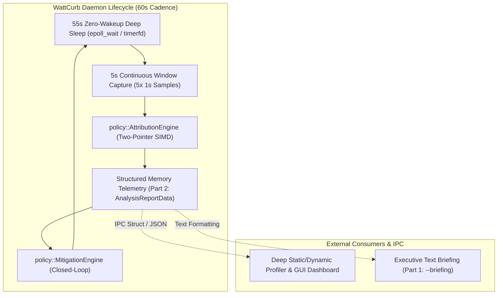

# [REF-ARCH-008] Two-Part Telemetry Interface & Adaptive Closed-Loop Mitigation Architecture

## 1. Architectural Overview
- **Ref-ID**: `REF-ARCH-008`
- **Module**: `core::DaemonRunner`, `report::ReportGenerator`, `policy::MitigationEngine`, `policy::ProcessClassifierDB`
- **Related Specifications**: [`REF-REQ-019`](../requirements/REQ-016-two-part-telemetry-and-adaptive-mitigation.md), [`REF-RES-008`](../research/RES-008-deep-process-classification-and-mitigation-db.md)
- **Status**: Approved



---

## 2. Component Design

### 2.1. Process Classification Engine (`policy::ProcessClassifierDB`)
Implements zero-allocation, compile-time string prefix and pattern matching:
```cpp
enum class ProcessSafetyTier : uint8_t {
    CriticalImmune = 0,    // systemd, pipewire, dbus, kernel (DO NOT TOUCH)
    DesktopCore = 1,       // kwin, mutter, Xorg (NEVER FREEZE/KILL)
    DesktopShell = 2,      // plasmashell (Reclaim only)
    UserInteractive = 3,   // chrome, code, kitty (Conditional throttle/reclaim)
    BackgroundWorker = 4,  // baloo, updatedb, tracker (Aggressive IDLE/freeze)
    RunawayCandidate = 5   // Orphaned build jobs, runaway scripts (Freeze/Kill)
};

enum class MitigationAction : uint8_t {
    None = 0,
    SchedIdle = 1,         // sched_setscheduler(SCHED_IDLE) + ionice(class 3)
    RelaxTimerSlack = 2,   // timerslack_ns -> 100ms ~ 500ms
    MemoryReclaim = 3,     // cgroup.memory.reclaim
    CgroupFreeze = 4,      // cgroup.freeze = 1
    Terminate = 5          // SIGTERM (emergency only)
};
```

### 2.2. Closed-Loop Mitigation State Machine
The mitigation engine tracks an audit log of all applied restrictions:
- Maintains active throttled PIDs in a `FixedVector<ActiveMitigationRecord, 128>`.
- Evaluates power delta between cycles:
  $$ \Delta P_{\text{actual}} = P_{\text{hardware}}(t - 1) - P_{\text{hardware}}(t) $$
- If a process becomes active or unfrozen by user activity, resets its state within `< 1ms`.

### 2.3. Executive Briefing Generator
Generates a human-friendly executive summary without ANSI clutter for terminal status queries:
```text
================================================================================
                    WATTCURB EXECUTIVE BATTERY BRIEFING
================================================================================
- Power State    : Discharging (37%), Battery Health: 94.2%
- Current Drain  : 21.47 W (Estimated remaining: 0.73h)
- Primary Sink   : GPU Silicon (AMDGPU) consuming 5.33 W (24.8% of system rail)
- Top Culprit    : PID 12035 (kitty) consuming 6.13 W via Active Network Sockets
- Active Guards  : 3 background indexers demoted to SCHED_IDLE (est. -450mW saved)
- Recommendation : Close unused WiFi CAM sockets or freeze background renderers.
================================================================================
```
