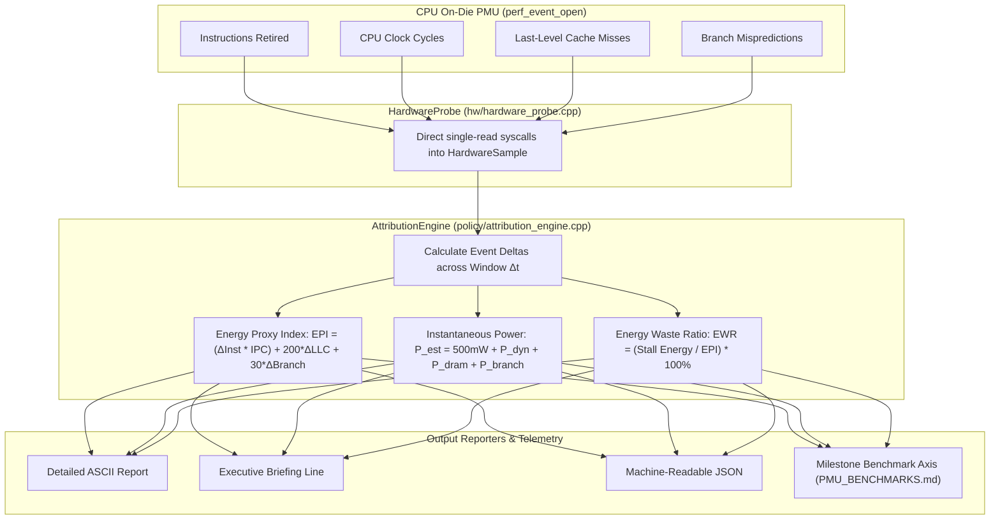

# [REF-ARCH-014] PMU Power Proxy Engine & Milestone Telemetry Axis

- **Ref-ID**: `REF-ARCH-014`
- **Related Architecture**: [`REF-ARCH-001`](file:///home/jedclub/Develop/WattCurb/docs/architecture/ARCH-001-daemon-architecture.md), [`REF-ARCH-003`](file:///home/jedclub/Develop/WattCurb/docs/architecture/ARCH-003-pgo-pmu-pipeline.md), [`REF-ARCH-013`](file:///home/jedclub/Develop/WattCurb/docs/architecture/ARCH-013-battery-telemetry-fine-grained-profiling.md)
- **Related Requirements**: [`REF-REQ-024`](file:///home/jedclub/Develop/WattCurb/docs/requirements/REQ-021-pmu-energy-proxy-telemetry.md)
- **Related Research**: [`REF-RES-005`](file:///home/jedclub/Develop/WattCurb/docs/research/PMU_BENCHMARKS.md)
- **Author**: WattCurb Core Architecture Team
- **Status**: Implemented / Active Reference
- **Date**: 2026-09-13

---

## 1. Subsystem Overview

The **PMU Power Proxy Engine** bridges the gap between raw hardware event counters and empirical energy attribution. By capturing CPU core activity, cache misses, and pipeline mispredictions entirely on-die via `perf_event_open`, it produces three zero-overhead proxy metrics:

---

## 2. Zero-Wakeup & Zero-Allocation Invariants

1. **Unprivileged Calling-Process Counting**:
   - `perf_event_open` is initialized with `pid = 0, cpu = -1, exclude_kernel = 1, exclude_hv = 1`.
   - Requires zero root privileges (`CAP_PERFMON` not required).
   - Reads take place via single 8-byte `::read(fd, &buf, sizeof(buf))` calls directly into stack variables.
2. **Zero Polling & Zero-EC Interaction**:
   - The engine operates purely in CPU registers and L1 cache.
   - Eliminates periodic queries to the slow Embedded Controller (EC) SMBus, maintaining CPU Package C10 residency.
3. **Deterministic Arithmetic**:
   - All divisions guard against zero cycles and zero delta time.
   - Outputs are saturated and clamped to physical bounds ($0.0 \sim 100.0\%$).
