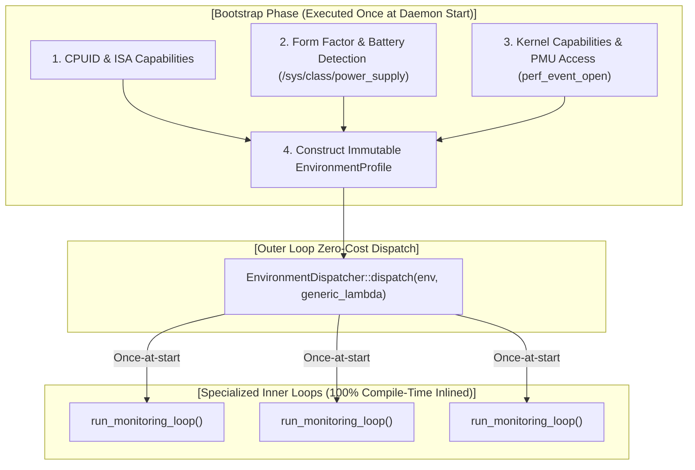

# [REF-ARCH-016] C++23 Zero-Cost Environment Dispatch & Policy Architecture

- **Ref-ID**: `REF-ARCH-016`
- **Title**: C++23 Zero-Cost Environment Dispatch & Policy Architecture
- **Status**: Approved
- **Author**: Antigravity Agent
- **Date**: 2026-09-13
- **Related Requirements**: [`REF-REQ-026`](file:///home/jedclub/Develop/WattCurb/docs/requirements/REQ-023-zero-cost-environment-abstraction.md)
- **Related Architecture**: [`REF-ARCH-005`](file:///home/jedclub/Develop/WattCurb/docs/architecture/ARCH-005-zero-cost-cpuid-simd.md), [`REF-ARCH-006`](file:///home/jedclub/Develop/WattCurb/docs/architecture/ARCH-006-portable-binary-zero-overhead-dispatch.md), [`REF-ARCH-015`](file:///home/jedclub/Develop/WattCurb/docs/architecture/ARCH-015-extreme-branchless-simd-bit-hacking.md)
- **Related Research**: [`REF-RES-005`](file:///home/jedclub/Develop/WattCurb/docs/research/PMU_BENCHMARKS.md)

---

## 1. High-Level Design & Architectural Pipeline

The C++23 Zero-Cost Environment Framework decouples environmental variability from the hot runtime execution path:



---

## 2. C++23 Concepts & Policy Definitions

### 2.1 CPU ISA Policy Concept
Enforces that every CPU tier implementation provides high-throughput, non-allocating micro-routines:
```cpp
template <typename T>
concept CpuIsaPolicyConcept = requires(const char*& cur, const char* end, int count, void* ptr) {
    { T::skip_whitespace(cur, end) } noexcept -> std::same_as<void>;
    { T::find_whitespace(cur, end) } noexcept -> std::same_as<void>;
    { T::skip_tokens(cur, end, count) } noexcept -> std::same_as<void>;
    { T::clear_cacheline_64(ptr) } noexcept -> std::same_as<void>;
    { T::read_core_id() } noexcept -> std::same_as<uint32_t>;
    { T::read_tsc() } noexcept -> std::same_as<uint64_t>;
    { T::tier_name() } noexcept -> std::same_as<std::string_view>;
};
```

### 2.2 Platform Policy Concept
Enforces static queries and sensor pruning for specific machine form-factors:
```cpp
template <typename T>
concept PlatformPolicyConcept = requires {
    { T::has_battery() } noexcept -> std::same_as<bool>;
    { T::supports_zen_ccx() } noexcept -> std::same_as<bool>;
    { T::supports_pmu() } noexcept -> std::same_as<bool>;
    { T::form_factor_name() } noexcept -> std::same_as<std::string_view>;
};
```

---

## 3. Concrete Policy Implementations

### 3.1 ISA Policies
1. `ZenSpecializedIsaPolicy`:
   - Utilizes `_pdep_u32` for $O(1)$ token selection.
   - Utilizes `_mm256_min_epu8` vector range checking for whitespace.
   - Emits native `clzero` assembly instruction for 64B cache clearing.
   - Emits native `rdpid` instruction for 1-cycle core resolution.
2. `Avx2Bmi2IsaPolicy`:
   - Utilizes AVX2 vector masking and BMI2 PDEP.
   - Fallback `std::memset` for cacheline clearing (Intel platforms lacking `clzero`).
3. `ScalarGenericIsaPolicy`:
   - Pure standard C++ scalar loops without vector intrinsics.
   - Universal execution guarantee on any x86-64 machine.

### 3.2 Platform Policies
1. `MobileLaptopPolicy`:
   - `has_battery() == true`
   - Fully executes deep battery fuel gauge, ThinkPad EC threshold acquisition, and USB-PD telemetry.
2. `DesktopWorkstationPolicy`:
   - `has_battery() == false`
   - Battery probing functions are statically compiled as **empty inline no-ops**, completely eliminating failed sysfs open attempts.
3. `VirtualHeadlessPolicy`:
   - Headless cloud VM / container configuration.
   - Bypasses battery and physical hardware bus probes, focusing purely on procfs process attribution.

---

## 4. Zero-Overhead Dispatch Mechanism

The dispatcher instantiates a closed set of concrete specializations:
```cpp
template <typename Func>
void EnvironmentDispatcher::dispatch(const EnvironmentProfile& env, Func&& worker) {
    // In native compilation, this collapses at compile time to 1 path
#if defined(WATTCURB_FORCE_NATIVE_SPECIALIZATION)
    worker(NativeEnvironmentPolicy{});
#else
    if (env.isa_tier == CpuIsaTier::ZenClzero) {
        if (env.form_factor == PlatformFormFactor::MobileLaptop) {
            worker(CombinedPolicy<ZenSpecializedIsaPolicy, MobileLaptopPolicy>{});
        } else if (env.form_factor == PlatformFormFactor::DesktopWorkstation) {
            worker(CombinedPolicy<ZenSpecializedIsaPolicy, DesktopWorkstationPolicy>{});
        } else {
            worker(CombinedPolicy<ZenSpecializedIsaPolicy, VirtualHeadlessPolicy>{});
        }
    } else if (env.isa_tier == CpuIsaTier::Avx2Bmi2) {
        if (env.form_factor == PlatformFormFactor::MobileLaptop) {
            worker(CombinedPolicy<Avx2Bmi2IsaPolicy, MobileLaptopPolicy>{});
        } else {
            worker(CombinedPolicy<Avx2Bmi2IsaPolicy, DesktopWorkstationPolicy>{});
        }
    } else {
        worker(CombinedPolicy<ScalarGenericIsaPolicy, DesktopWorkstationPolicy>{});
    }
#endif
}
```
Within the `worker` generic lambda, the compiler stamps out separate inlined functions where **all policy calls are direct static inlined instructions**, achieving mathematical **Zero Runtime Branch Overhead**.
