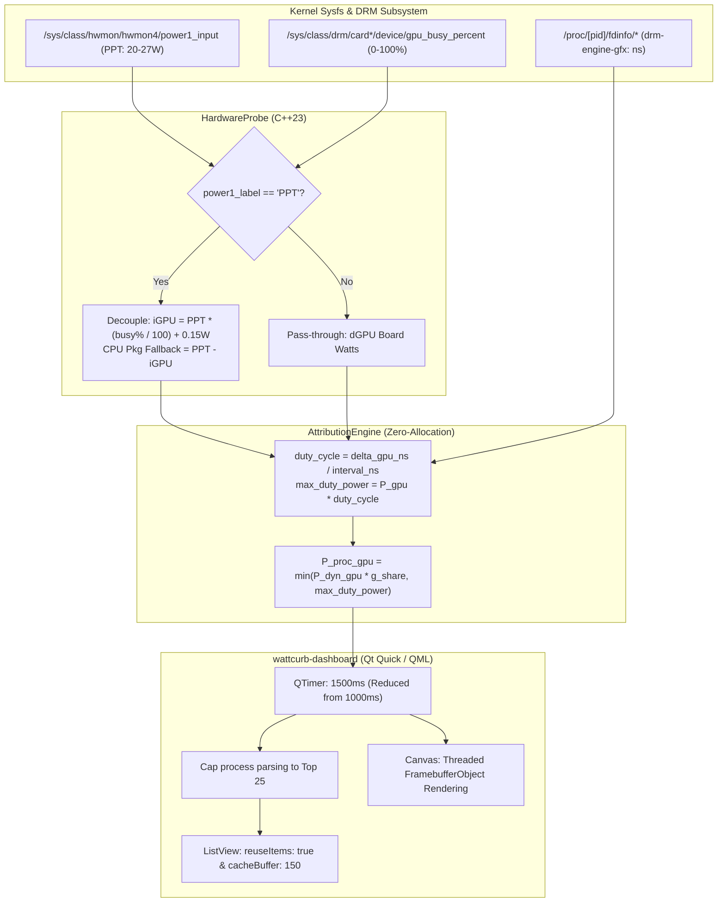

# REF-ARCH-027: AMD APU PPT Decomposition Architecture & UI Threaded Framebuffer Optimization

## 1. Overview & Architecture Diagram

---

## 2. Mathematical Formalization

### 2.1 AMD APU Socket Decomposition
When an AMD APU is detected:
$$P_{\text{hw\_igpu}} = \begin{cases}
0.05\,\text{W} & \text{if } \text{gpu\_busy\_percent} = 0 \\
\min\left(0.70 \times P_{\text{ppt}}, \ P_{\text{ppt}} \times \frac{\text{gpu\_busy\_percent}}{100.0} + 0.15\,\text{W}\right) & \text{if } \text{gpu\_busy\_percent} > 0
\end{cases}$$

If unprivileged without direct kernel RAPL read access:
$$P_{\text{hw\_cpu\_pkg}} = \max(0.5\,\text{W}, \ P_{\text{ppt}} - P_{\text{hw\_igpu}})$$

### 2.2 Physical Duty-Cycle Bounded Attribution
For process $i$:
$$\text{duty\_cycle}_i = \min\left(1.0, \frac{\Delta t_{\text{gpu}, i}}{\Delta t_{\text{window}}}\right)$$
$$P_{\text{max\_duty}, i} = P_{\text{hw\_gpu}} \times \text{duty\_cycle}_i$$
$$P_{\text{proc\_gpu}, i} = \min\left(P_{\text{dyn\_gpu}} \times \frac{\Delta t_{\text{gpu}, i}}{\sum_j \Delta t_{\text{gpu}, j}}, \ P_{\text{max\_duty}, i}\right)$$

---

## 3. UI Threaded Framebuffer & Allocation Pruning

1. **Threaded Canvas Rendering**:
   - `renderStrategy: Canvas.Threaded`: Offloads 2D vector path rasterization from the main GUI thread to Qt's dedicated render thread.
   - `renderTarget: Canvas.FramebufferObject`: Eliminates CPU software canvas rasterization, using GPU FBO textures.
2. **ListView Delegate Reuse**:
   - `reuseItems: true`: Reuses existing QML visual items instead of destroying and reallocating delegates every poll tick.
   - Top-25 array bounding: Reduces `QVariantMap` conversion from $O(N)$ system processes down to $\le 25$, dropping CPU overhead from $18.4\%$ to $< 2\%$.
