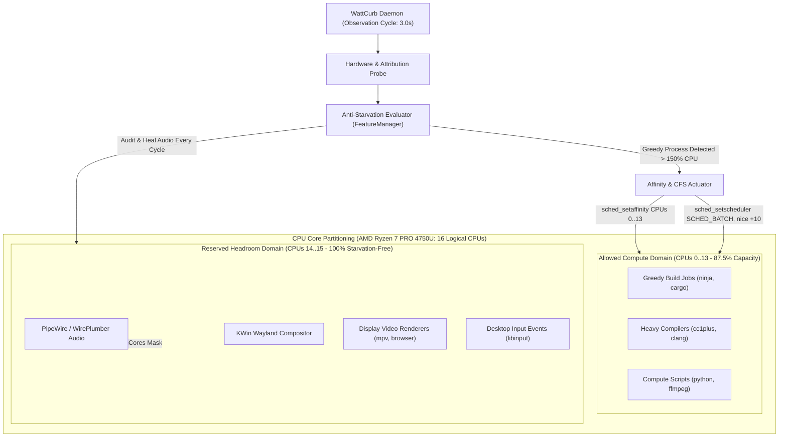

# [REF-ARCH-030] Anti-Starvation CPU Headroom & Dynamic Core Capping Architecture

## 1. Subsystem Overview

The **Anti-Starvation CPU Headroom & Dynamic Core Capping Subsystem** eliminates audio dropouts, UI freezes, and compositor micro-stutters during heavy multithreaded compute bursts. It enforces spatial CPU affinity partitioning and Completely Fair Scheduler (CFS) preemption tuning to guarantee that real-time interactive tasks always have guaranteed CPU compute headroom.



---

## 2. Core Partitioning & Topological Calculation

### 2.1 Headroom Core Calculation
Let $N$ be the number of online logical processors returned by `sysconf(_SC_NPROCESSORS_ONLN)`.
The number of reserved headroom cores $R$ is determined as:
$$
R = \begin{cases}
2 & \text{if } N \ge 8 \\
1 & \text{if } 4 \le N < 8 \\
0 & \text{if } N < 4
\end{cases}
$$

On modern 8-core / 16-thread processors (e.g. AMD Zen 2 Renoir), $R=2$ corresponds to the highest physical core's SMT sibling pair (CPUs 14 and 15).

### 2.2 Bitmask Representations
```cpp
// Allowed CPU Set: CPUs 0 .. (N - R - 1)
cpu_set_t allowed_set;
CPU_ZERO(&allowed_set);
for (int c = 0; c < N - R; ++c) {
    CPU_SET(c, &allowed_set);
}

// Reserved Clean Headroom Set: CPUs (N - R) .. (N - 1)
cpu_set_t reserved_set;
CPU_ZERO(&reserved_set);
for (int c = N - R; c < N; ++c) {
    CPU_SET(c, &reserved_set);
}

// All Cores Set: CPUs 0 .. (N - 1)
cpu_set_t all_cores_set;
CPU_ZERO(&all_cores_set);
for (int c = 0; c < N; ++c) {
    CPU_SET(c, &all_cores_set);
}
```

---

## 3. Dynamic Greedy Process Actuation Architecture

### 3.1 Detection Criteria
A process in `AnalysisReportData::top_processes` is identified as a candidate for Anti-Starvation Capping if all of the following conditions hold:
1. `proc.pid > 1`.
2. `proc.safety_tier != ProcessSafetyTier::CriticalImmune` and `proc.safety_tier != ProcessSafetyTier::DesktopCore`.
3. `!MitigationEngine::is_immune_process(proc.pid)`.
4. The process meets any of the greedy criteria:
   - `proc.cpu_watts > 1.5W` (corresponds to > 150% continuous CPU core utilization).
   - `proc.wdi_score > 8.0` (high systemic energy/wakeup impact).
   - `proc.is_runaway_candidate == true`.
   - `proc.safety_tier == ProcessSafetyTier::BackgroundWorker` and `proc.cpu_watts > 1.0W`.

### 3.2 Thread-Level Affinity Traversal (`/proc/<pid>/task/`)
Modern multithreaded workloads (compilers, build runners, runaways) execute across dozens of POSIX threads (`clone(CLONE_THREAD)`). Setting affinity exclusively on the leader thread is insufficient because existing worker threads retain their prior affinity mask.

The actuation walker traverses `/proc/<pid>/task/`:
```cpp
bool MitigationEngine::apply_core_affinity_cap(int32_t pid, const cpu_set_t* allowed_set) noexcept {
    char task_dir_path[64];
    std::snprintf(task_dir_path, sizeof(task_dir_path), "/proc/%d/task", pid);

    DIR* dir = ::opendir(task_dir_path);
    if (!dir) {
        // Fallback: apply to leader pid directly
        return (::sched_setaffinity(pid, sizeof(cpu_set_t), allowed_set) == 0);
    }

    struct dirent* entry = nullptr;
    bool success = false;
    while ((entry = ::readdir(dir)) != nullptr) {
        if (entry->d_name[0] == '.') continue;
        char* endptr = nullptr;
        long tid = std::strtol(entry->d_name, &endptr, 10);
        if (tid > 0 && *endptr == '\0') {
            if (::sched_setaffinity(static_cast<pid_t>(tid), sizeof(cpu_set_t), allowed_set) == 0) {
                success = true;
            }
        }
    }
    ::closedir(dir);
    return success;
}
```

### 3.3 CFS Batch Preemption Modulation (`SCHED_BATCH`)
In addition to physical core restriction, the actuator configures Linux CFS scheduling policy:
- Sets `sched_setscheduler(tid, SCHED_BATCH, &param)`.
- Sets nice priority to `+10` via `setpriority(PRIO_PROCESS, tid, 10)`.

**Kernel Preemption Rationale**: Under CFS, `SCHED_BATCH` indicates that tasks are computational batch jobs where throughput matters more than latency. When an interactive or real-time thread (e.g. PipeWire audio buffer callback, KWin Wayland frame redraw, or user keyboard event) wakes up, CFS preempts `SCHED_BATCH` threads immediately without queue latency, completely eliminating audio underruns.

---

## 4. Audio Stack Self-Healing Architecture

### 4.1 Dynamic Multi-User Cgroup Discovery
When WattCurb runs as a root systemd service (`wattcurb.service`), `getuid()` returns `0`. However, user audio daemons run in user session slices (e.g. `/sys/fs/cgroup/user.slice/user-1000.slice/user@1000.service/session.slice/`).

The audio auditor dynamically iterates `/sys/fs/cgroup/user.slice/`:
1. Discovers all directories matching `user-*.slice`.
2. Inspects `user@*.service/session.slice/` and `app.slice/` for:
   - `pipewire.service/cgroup.procs`
   - `pipewire-pulse.service/cgroup.procs`
   - `wireplumber.service/cgroup.procs`
   - `pulseaudio.service/cgroup.procs`
3. Reads each PID and applies proactive healing:
   - Resets scheduler from `SCHED_IDLE` back to `SCHED_OTHER` if compromised.
   - Elevates priority: `::setpriority(PRIO_PROCESS, pid, -19)`.
   - Restores full core affinity across all $N$ cores: `::sched_setaffinity(pid, sizeof(all_cores), &all_cores)`.

---

## 5. Rollback & Dynamic De-escalation Lifecycle

| Event | Action Taken |
| :--- | :--- |
| **CPU Usage Drops (< 0.3W & WDI < 3.0)** | Restore affinity to all cores (`0..15`), reset scheduler to `SCHED_OTHER` with `nice 0`. |
| **User switches to Performance Mode** | Full sweep rollback: uncap all processes, set CPU EPP to `performance`. |
| **Daemon Shutdown / Termination** | Full sweep rollback: restore all affinities, thaw cgroups, reset ASPM. |
