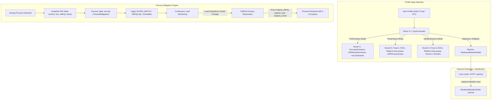

# [REF-ARCH-031] Dual-Domain State Snapshot Journal & Deterministic Profile Actuation Architecture

## 1. Architectural Model & Dual-Domain Journaling

To guarantee 100% faithful restoration, WattCurb partitions state preservation into two distinct, zero-overhead journals:
1. **Process-Level State Journal** (`TrackedMitigation`): Records the exact pre-mitigation state (nice, scheduler policy, affinity mask, timerslack) for every modulated process before altering it.
2. **Hardware-Level Baseline Journal** (`HardwareBaselineState`): Snapshots the host platform's native power state at initialization and serves as the immutable reference for restoration.



---

## 2. Data Structures & Memory Layout

### 2.1 Hardware Baseline Journal (`HardwareBaselineState`)
```cpp
struct alignas(64) HardwareBaselineState {
    bool captured{false};
    char platform_profile[32]{"balanced"};
    char cpu_governor[32]{"schedutil"};
    int cpu_boost{1};
    char aspm_policy[32]{"default"};
    uint32_t scaling_max_freq_khz{0};
    uint32_t panel_power_savings{1};
};
```
- Fits within a single 64-byte hardware cache line.
- Initialized once during daemon bootstrap.

### 2.2 Process Mitigation Journal (`TrackedMitigation`)
```cpp
struct alignas(64) TrackedMitigation {
    int32_t pid{0};
    ProcessSafetyTier tier{ProcessSafetyTier::BackgroundWorker};
    MitigationAction current_action{MitigationAction::None};
    uint64_t applied_timestamp_sec{0};

    // Pre-Mitigation Baseline State Journal
    int original_nice{0};
    int original_sched_policy{SCHED_OTHER};
    uint64_t original_timerslack_ns{50000};
    cpu_set_t original_affinity{};
    bool affinity_capped{false};
    bool sched_batch_applied{false};
    bool sched_idle_applied{false};
};
```
- Exactly 64 bytes aligned.
- Holds the complete snapshot needed to undo any scheduler or affinity change.

---

## 3. Direct Native Sysfs Actuators (Zero-Subshell Overhead)

Rather than delegating hardware state transitions to forked bash processes (which incur > 10ms fork/exec latency and high CPU wakeups), WattCurb provides direct, native C++ POSIX sysfs writers:

```cpp
bool MitigationEngine::set_platform_profile(const char* profile) noexcept;
bool MitigationEngine::set_cpu_governor(const char* governor) noexcept;
bool MitigationEngine::set_cpu_boost(bool enable) noexcept;
bool MitigationEngine::set_cpu_scaling_max_freq(uint32_t khz) noexcept;
bool MitigationEngine::set_panel_power_savings(uint32_t level) noexcept;
bool MitigationEngine::set_pcie_aspm_policy(const char* policy) noexcept;
```

Each actuator writes directly to kernel sysfs nodes in < 5 microseconds using unbuffered direct descriptors.

---

## 4. Faithful Restoration Lifecycle

### 4.1 Process De-escalation & Rollback Sequence
1. **Thread-Wide Affinity Restoration**:
   If `affinity_capped == true`:
   Traverse `/proc/<pid>/task/` and invoke `::sched_setaffinity(tid, sizeof(cpu_set_t), &original_affinity)`.
2. **Scheduler Policy & Nice Restoration**:
   If `sched_batch_applied || sched_idle_applied`:
   Reset `::setpriority(PRIO_PROCESS, pid, original_nice)`.
   Reset `::sched_setscheduler(pid, original_sched_policy, &sp)`.
3. **Timer Slack Restoration**:
   Write `original_timerslack_ns` to `/proc/<pid>/timerslack_ns`.

### 4.2 Hardware Rollback Sequence
1. Write `s_hw_baseline.platform_profile` to `/sys/firmware/acpi/platform_profile`.
2. Write `s_hw_baseline.cpu_governor` to `/sys/devices/system/cpu/cpu*/cpufreq/scaling_governor`.
3. Write `s_hw_baseline.cpu_boost` to `/sys/devices/system/cpu/cpufreq/boost`.
4. If `s_hw_baseline.scaling_max_freq_khz > 0`, restore it across all CPUs.
5. Write `s_hw_baseline.aspm_policy` to `/sys/module/pcie_aspm/parameters/policy`.
6. Write `s_hw_baseline.panel_power_savings` to `/sys/class/drm/card*-eDP-1/amdgpu/panel_power_savings`.
