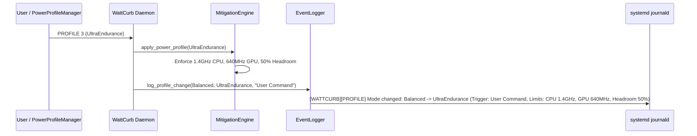
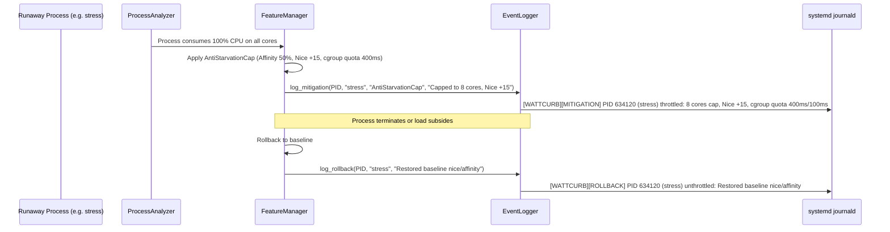

# ARCH-035: Zero-Disk-Wakeup Event Journal & SHM History Ring-Buffer

- **Ref-ID**: `REF-ARCH-035`
- **Category**: Software Architecture & In-Memory Data Structures
- **Status**: Approved
- **Domain**: Low-Latency C++23, Seqlock, Shared Memory, systemd Journald
- **Dependencies**: [`REF-REQ-059`](file:///home/jedclub/Develop/WattCurb/docs/requirements/REQ-059-zero-disk-wakeup-logging-and-telemetry-history.md), [`REF-ARCH-018`](file:///home/jedclub/Develop/WattCurb/docs/architecture/ARCH-018-seqlock-binary-shm-and-json-streaming.md), [`REF-REQ-028`](file:///home/jedclub/Develop/WattCurb/docs/requirements/REQ-026-binary-seqlock-data-supply-and-json-elimination.md)
- **Related Tests**: [`REF-TEST-024`](file:///home/jedclub/Develop/WattCurb/docs/requirements/REQ-059-zero-disk-wakeup-logging-and-telemetry-history.md#3-verification--oracle-gate-standards-ref-test-024)

---

## 1. Architectural Overview

To satisfy [`REF-REQ-059`](file:///home/jedclub/Develop/WattCurb/docs/requirements/REQ-059-zero-disk-wakeup-logging-and-telemetry-history.md) while strictly preserving NVMe APST low-power sleep states, WattCurb partitions logging into two zero-cost domains:
1. **EventLogger**: A stack-formatted, zero-heap event journal triggered solely on state transitions.
2. **HistoryRingBuffer**: A 19.3 KB circular array in `/dev/shm/wattcurb_history.bin` storing the most recent 600 telemetry points.

```
+-----------------------------------------------------------------------------------------+
|                                    WattCurb Daemon Core                                 |
+-----------------------------------------------------------------------------------------+
       |                                                                   |
       | (Periodic 3.0s Cadence)                                           | (State Transitions Only)
       v                                                                   v
+-----------------------------------------+            +------------------------------------+
|       HistoryRingBuffer (RAM Only)      |            |         EventLogger (Auditing)     |
|  - File: /dev/shm/wattcurb_history.bin  |            |  - Zero-heap stack formatting      |
|  - Capacity: 600 samples (~30 min)      |            |  - Triggers: Profile, Mitigation,  |
|  - Footprint: 19,264 Bytes (L1D Cache)  |            |    Rollback, Battery Alert         |
|  - Writes: In-memory pointer wrap       |            |  - Targets: stdout (journald)      |
|  - Disk I/O: EXACTLY 0 BYTES            |            |    & /var/log/wattcurb/audit.log   |
+-----------------------------------------+            +------------------------------------+
       |                                                                   |
       v                                                                   v
  [wattcurb --history]                                        [journalctl -u wattcurb]
  [Dashboard HUD History]                                     [wattcurb --logs]
```

---

## 2. Component Design & Memory Layout

### 2.1 HistoryPoint POD Definition
Each historical sample is tightly packed into an aligned 32-byte struct:

```cpp
struct alignas(32) HistoryPoint {
    uint64_t timestamp_sec;       // 8 bytes: Unix epoch seconds
    uint32_t total_system_mw;     // 4 bytes: Total platform draw in mW
    uint16_t cpu_package_mw;      // 2 bytes: CPU Package draw in mW
    uint16_t gpu_mw;              // 2 bytes: GPU draw in mW
    uint16_t cpu_temp_c;          // 2 bytes: CPU temperature in Celsius
    uint16_t cpu_freq_mhz;        // 2 bytes: Realtime average CPU clock
    uint8_t  battery_percent;     // 1 byte: 0-100%
    uint8_t  battery_state;       // 1 byte: 0=AC, 1=Discharging, 2=Passthrough
    uint8_t  power_profile_mode;  // 1 byte: 0=Performance, 1=Balanced, 2=PowerSaver, 3=Ultra
    uint8_t  cstate_c3_percent;   // 1 byte: Deep C3 residency %
    uint8_t  active_mitigations;  // 1 byte: Count of throttled processes
    uint8_t  reserved[7];         // 7 bytes: Padding to 32-byte boundary
};
static_assert(sizeof(HistoryPoint) == 32, "HistoryPoint must be exactly 32 bytes");
```

### 2.2 Shared Memory Ring-Buffer Header
The layout of `/dev/shm/wattcurb_history.bin`:

```cpp
struct alignas(64) HistoryRingBufferShm {
    uint64_t seq_version;         // Seqlock counter (odd=updating, even=stable)
    uint32_t capacity;            // 600 entries
    uint32_t head_index;          // Next insertion index (0 .. 599)
    uint32_t count;               // Current valid count (up to 600)
    uint8_t  reserved[44];        // Cacheline alignment padding (64 bytes total header)
    HistoryPoint entries[600];    // 600 * 32 = 19,200 bytes
};
// Total Size: 64 + 19,200 = 19,264 bytes (< 20 KB)
```

### 2.3 EventLogger Stack Formatter
All log messages are formatted directly on the stack without allocating `std::string` or calling dynamic heap allocators:
- Fixed-size stack buffer: `char line[256]`
- Prefixed with ISO8601 UTC/Local timestamp: `YYYY-MM-DD HH:MM:SS`
- Output streams:
  1. `::write(STDOUT_FILENO, ...)`: Absorbed by systemd journald without filesystem disk flushes.
  2. `::write(audit_fd, ...)`: Directly appended to `/var/log/wattcurb/audit.log` when available.

---

## 3. Interaction Scenarios

### 3.1 Profile Switching Event


### 3.2 Mitigation Actuation & Rollback

