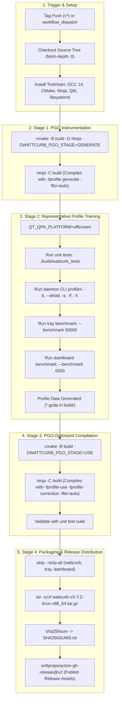

# REF-ARCH-054: GitHub Actions Multi-Stage PGO Release Pipeline Topology

## 1. Architectural Scope & Purpose

This document specifies the architectural execution topology and lifecycle transitions of the WattCurb automated GitHub Actions release CI/CD workflow defined in `REF-REQ-077`. It formalizes the build matrix, profile persistence strategy, and artifact bundling structure.

---

## 2. Pipeline Execution Topology



---

## 3. Profile Alignment Strategy (Single Build Tree In-Place)

In GCC PGO workflows, `-fprofile-generate` writes `.gcda` files alongside object files based on relative or absolute paths embedded during compilation.
To eliminate filesystem path divergence or directory mismatches:
1. **Single Build Directory (`build/`)**: Both Stage 1 and Stage 3 operate inside the exact same build directory.
2. **In-Place Reconfiguration**: CMake reconfigures `build/` with `-DWATTCURB_PGO_STAGE=USE`.
3. **Correction Flag**: The `-fprofile-correction` flag handles multi-threaded counter synchronization smoothing, preventing false compilation halts.

---

## 4. Release Distribution Artifact Layout

The packaged tarball `wattcurb-${TAG}-linux-x86_64.tar.gz` contains the complete self-contained deployment:

```text
wattcurb-${TAG}-linux-x86_64/
├── bin/
│   ├── wattcurb                 # PGO-optimized resident daemon & CLI
│   ├── wattcurb-tray            # PGO-optimized StatusNotifierItem tray client
│   └── wattcurb-dashboard       # PGO-optimized KDE Plasma 6 matrix dashboard
├── systemd/
│   ├── wattcurb.service         # Root hardware profiling service
│   └── wattcurb-user.service    # User session desktop tray service
├── desktop/
│   ├── wattcurb-tray.desktop    # XDG autostart tray entry
│   └── wattcurb-dashboard.desktop # Desktop application menu entry
├── install.sh                   # One-shot system installation script
├── uninstall.sh                 # Clean zero-residual uninstallation script
├── README.md                    # Quick start documentation
└── LICENSE                      # MIT License
```

---

## 5. Security & Verification Guardrails
- **Integrity**: Every release publishes `SHA256SUMS.txt`.
- **Reproducibility**: All compile flags (`-O3`, `-flto=auto`, `-fvisibility=hidden`, `-DNDEBUG`) are strictly version-controlled in `CMakeLists.txt`.
- **Release Gating**: If any Stage 2 training step or post-PGO validation test fails, the workflow terminates immediately, preventing defective releases from being published.
