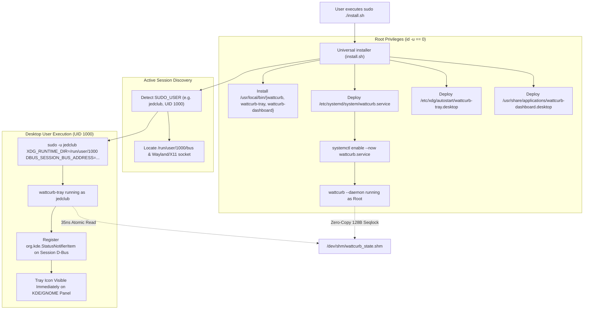

# ARCH-057: Universal Package Installer & Dual Root/User Autostart Topology

## 1. Overview & Context

- **REF-ID**: `REF-ARCH-057`
- **Related Requirements**: [`REF-REQ-080`](file:///home/jedclub/Develop/WattCurb/docs/requirements/REQ-080-package-autostart-and-immediate-tray-launch.md), [`REF-REQ-053`](file:///home/jedclub/Develop/WattCurb/docs/requirements/REQ-053-native-root-systemd-service-and-brightness-immunity.md), [`REF-REQ-077`](file:///home/jedclub/Develop/WattCurb/docs/requirements/REQ-077-automated-github-actions-pgo-release-pipeline.md)
- **Related Architecture**: [`REF-ARCH-026`](file:///home/jedclub/Develop/WattCurb/docs/architecture/ARCH-026-production-systemd-service-and-autostart-topology.md), [`REF-ARCH-054`](file:///home/jedclub/Develop/WattCurb/docs/architecture/ARCH-054-github-actions-pgo-release-topology.md)

---

## 2. Installation Execution & Session Handshake Topology



---

## 3. Package File Manifest

```text
wattcurb-${TAG}-linux-x86_64/
├── bin/
│   ├── wattcurb                       # Core profiling daemon & CLI
│   ├── wattcurb-tray                  # Qt6 StatusNotifierItem desktop client
│   └── wattcurb-dashboard             # Qt6 matrix monitoring dashboard
├── systemd/
│   └── wattcurb.service               # Root system service descriptor
├── desktop/
│   ├── wattcurb-tray.desktop          # Universal XDG autostart descriptor
│   └── wattcurb-dashboard.desktop     # Desktop application launcher
├── install.sh                         # Unified root service & user GUI installer
├── uninstall.sh                       # Zero-residual system uninstaller
├── README.md                          # Quick-start instructions
└── LICENSE                            # MIT License
```

---

## 4. Failure Modes & Mitigations

1. **Headless / Server Installation (No GUI Session)**:
   - If `$SUDO_USER` does not exist or `/run/user/${UID}/bus` is unavailable, `install.sh` falls back gracefully without crashing.
   - The root daemon is successfully enabled and running in the background.
2. **Multiple Display Users**:
   - The deployment to `/etc/xdg/autostart/wattcurb-tray.desktop` guarantees that whenever any user opens a desktop session, their desktop manager automatically invokes `wattcurb-tray`.
3. **Tray Crash or Restart**:
   - StatusNotifierItem is resilient to restarts. Both the daemon and tray communicate asynchronously via `/dev/shm/wattcurb_state.shm`, ensuring zero lock contention and instantaneous recovery.
