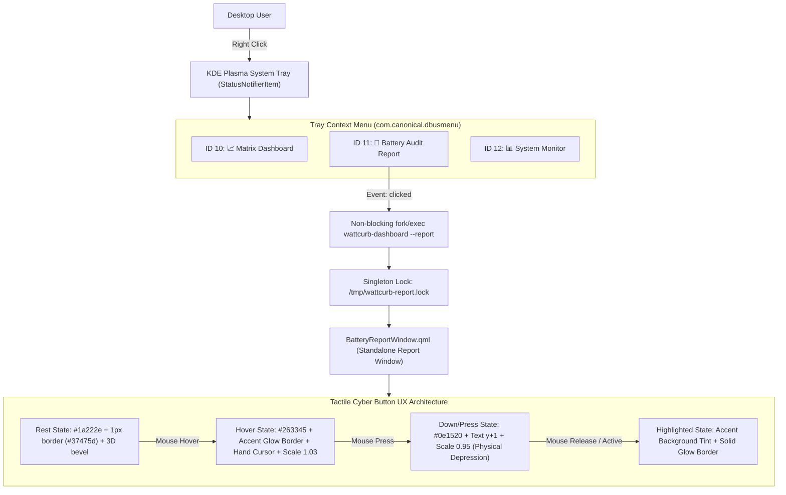

# ARCH-058: Tactile Cyber Button Component & Direct Tray Action Topology

## 1. Overview & Context

- **REF-ID**: `REF-ARCH-058`
- **Related Requirements**: [`REF-REQ-081`](file:///home/jedclub/Develop/WattCurb/docs/requirements/REQ-081-tray-battery-report-action-and-tactile-buttons.md), [`REF-REQ-078`](file:///home/jedclub/Develop/WattCurb/docs/requirements/REQ-078-battery-drain-deep-audit-report-and-window.md)
- **Related Architecture**: [`REF-ARCH-055`](file:///home/jedclub/Develop/WattCurb/docs/architecture/ARCH-055-deep-battery-drain-report-topology.md), [`REF-ARCH-025`](file:///home/jedclub/Develop/WattCurb/docs/architecture/ARCH-025-zero-alloc-sni-tray-client.md)

---

## 2. Interaction & Execution Topology



---

## 3. Tactile Button Component Specification

```qml
component TactileButton: Button {
    id: tBtn
    property color accentColor: root.colCyan
    property color baseColor: "#1a222e"
    property color hoverColor: "#263345"
    property color pressColor: "#0e1520"
    property color textColor: "#e2e8f0"
    property real customRadius: 6

    implicitHeight: 30
    hoverEnabled: true

    scale: !enabled ? 1.0 : (down ? 0.95 : (hovered ? 1.03 : 1.0))
    Behavior on scale { NumberAnimation { duration: 80; easing.type: Easing.OutQuad } }

    contentItem: RowLayout {
        spacing: 5
        anchors.centerIn: parent
        Text {
            text: tBtn.text
            font.pixelSize: 11
            font.bold: true
            color: !tBtn.enabled ? "#64748b" : (tBtn.highlighted ? "#ffffff" : (tBtn.hovered ? "#ffffff" : tBtn.textColor))
            horizontalAlignment: Text.AlignHCenter
            verticalAlignment: Text.AlignVCenter
            y: tBtn.down ? 1 : 0
        }
    }
    ...
}
```

---

## 4. Verification & Behavioral Guarantees

1. **Direct Tray Accessibility**: Users can open the Battery Audit Report immediately with 1 click from the desktop panel without going through the main dashboard.
2. **Zero-Overhead Memory Guarantee**: In-tree QML inline component compilation incurs 0 heap allocation in C++ backend and compiles directly to bytecode.
3. **Ergonomic Tactile Feedback**: Visual boundaries, physical 0.95 scale depression, and 3D beveling prevent accidental clicks and provide immediate tactile certainty.
