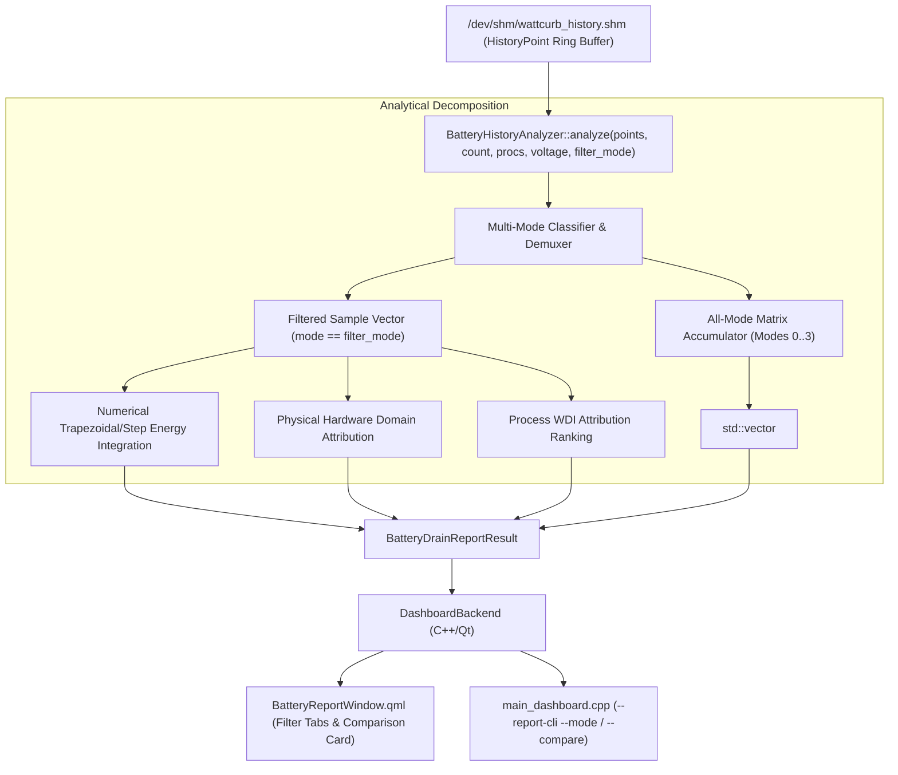

# REF-ARCH-063: Power Profile Telemetry Filtering & Comparative Analysis Architecture

- **Document ID**: `REF-ARCH-063`
- **Related Requirements**: [`REF-REQ-086`](../requirements/REQ-086-power-profile-telemetry-filtering-and-comparison.md)
- **Related Research**: [`REF-RES-024`](../research/RES-024-deep-power-log-audit-and-drain-analysis.md)
- **Status**: Approved
- **Date**: 2026-09-21

---

## 1. Architectural Overview & Component Interaction



---

## 2. Core Data Structures & Interfaces

### 2.1 Profile Comparison Entry
```cpp
namespace wattcurb::report {

struct ProfileComparisonEntry {
    uint8_t mode{0};           // 0=Performance, 1=Balanced, 2=PowerSaver, 3=UltraEndurance
    std::string mode_name;     // "Performance", "Balanced", "PowerSaver", "UltraEndurance"
    std::string mode_icon;     // "🚀", "⚖️", "🌿", "🔋"
    std::string color_hex;     // UI tint
    uint32_t sample_count{0};
    uint64_t duration_sec{0};
    std::string duration_str;
    double total_energy_wh{0.0};
    double avg_watts{0.0};
    double peak_watts{0.0};
    double avg_c3_percent{0.0};
    double avg_temp_c{0.0};
};

} // namespace wattcurb::report
```

### 2.2 Analyzer Interface Signature Update
```cpp
class BatteryHistoryAnalyzer {
public:
    static BatteryDrainReportResult analyze(
        const ipc::HistoryPoint* points,
        size_t count,
        const std::vector<ProcessAttributedPower>& top_procs,
        double current_voltage_v = 11.4,
        int filter_mode = -1 // -1: All, 0: Perf, 1: Balanced, 2: Save, 3: Ultra
    );

    static BatteryDrainReportResult analyze_shm(
        const std::vector<ProcessAttributedPower>& top_procs,
        double current_voltage_v = 11.4,
        int filter_mode = -1
    );
};
```

---

## 3. UI/UX & CLI Integration Flow

1. **QML Filter Toolbar (`BatteryReportWindow.qml`)**:
   - Implements a modern segmented filter bar with 5 buttons: `[전체 All]`, `[🚀 성능]`, `[⚖️ 균형]`, `[🌿 절전]`, `[🔋 초절전]`.
   - Binds `highlighted` property to `backend.reportFilterMode == targetMode`.
   - On click, invokes `backend.setReportFilterMode(targetMode)`, causing instant re-analysis and UI update.

2. **QML Cross-Profile Comparison Grid (`BatteryReportWindow.qml`)**:
   - Renders a multi-column comparison table displaying each profile's metric side-by-side.
   - Highlights the currently active row matching the selected filter.

3. **CLI Invocation (`main_dashboard.cpp`)**:
   - Supports `--report-cli --mode [all|perf|balanced|save|ultra]` to emit mode-specific telemetry.
   - Supports `--report-cli --compare` to display the cross-mode comparative matrix in terminal.

---

## 4. Verification & Oracle Gate Standards (`REF-TEST-050`)

- **Determinism**: Unit tests verify that filtering by mode `2` strictly excludes modes `0`, `1`, and `3`.
- **Integrity**: The sum of energy across filtered modes `0`, `1`, `2`, and `3` must equal the total energy of mode `-1` (within $\pm 0.01\%$).
- **Latency**: Filter switching on 60,480 samples must execute in $< 2.5$ ms.
