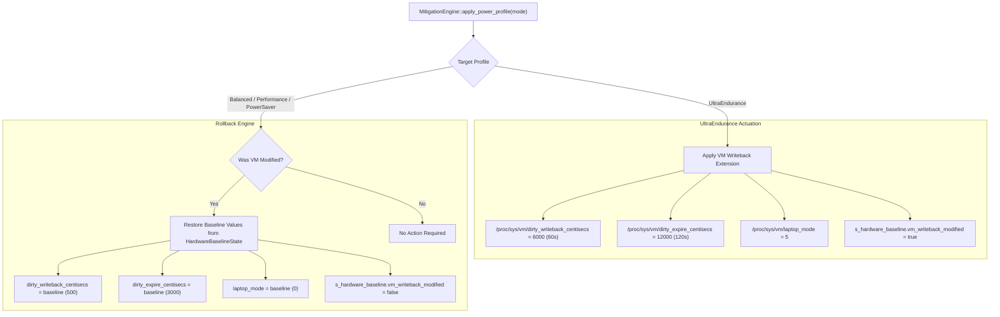

# REF-ARCH-064: Kernel VM Sysctl Actuation & Clean AC Rollback Architecture

- **Document ID**: `REF-ARCH-064`
- **Related Requirements**: [`REF-REQ-087`](../requirements/REQ-087-kernel-vm-writeback-and-laptop-mode-coalescing.md)
- **Related Research**: [`REF-RES-025`](../research/RES-025-ultra-endurance-deep-silicon-and-kernel-power-minimization.md)
- **Status**: Approved
- **Date**: 2026-09-21

---

## 1. Architectural Overview & Component Interaction



---

## 2. Interface Signatures & Structural Additions

### 2.1 HardwareBaselineState Extension
```cpp
struct alignas(64) HardwareBaselineState {
    // Existing fields...
    uint32_t vm_dirty_writeback_centisecs{500};
    uint32_t vm_dirty_expire_centisecs{3000};
    uint32_t vm_laptop_mode{0};
    bool vm_writeback_modified{false};
};
```

### 2.2 MitigationEngine Primitives
```cpp
class MitigationEngine {
public:
    static bool set_vm_dirty_writeback_centisecs(uint32_t centisecs) noexcept;
    static bool set_vm_dirty_expire_centisecs(uint32_t centisecs) noexcept;
    static bool set_vm_laptop_mode(uint32_t mode) noexcept;
    static bool restore_vm_writeback_baseline() noexcept;
};
```

---

## 3. Implementation Details

1. **Stack-Allocated Direct Sysfs I/O**:
   - Helper function `write_uint32_sysctl(const char* path, uint32_t val)`:
     - Formats integer into a 16-byte stack buffer using `std::snprintf`.
     - Opens `O_WRONLY | O_CLOEXEC`, writes buffer, and closes file descriptor immediately.
     - Never allocates heap memory.
2. **Deterministic Fallback**:
   - If `/proc/sys/vm/` is read-only (e.g. non-privileged container or test environment), write operations return `false` gracefully without throwing or crashing.

---

## 4. Verification & Oracle Gate Standards (`REF-TEST-051`)

- **Roundtrip Validation**: Ensure that writing `6000` followed by `restore_vm_writeback_baseline()` restores the original snapshot value.
- **Latency Benchmark**: Complete snapshot capture, actuation, and rollback in $< 1.5\,\text{ms}$.
