# REF-ARCH-065: Ultimate UltraEndurance Full-Spectrum Actuation Architecture

- **Document ID**: `REF-ARCH-065`
- **Related Requirements**: [`REF-REQ-088`](../requirements/REQ-088-ultimate-ultra-endurance-full-spectrum-power-minimization.md)
- **Related Research**: [`REF-RES-025`](../research/RES-025-ultra-endurance-deep-silicon-and-kernel-power-minimization.md)
- **Status**: Approved
- **Date**: 2026-09-21

---

## 1. Architectural Topology & Multi-Domain Pipeline

```mermaid
flowchart TD
    ProfileTrigger["apply_power_profile(UltraEndurance)"] --> P1["1. Silicon & APU Layer"]
    ProfileTrigger --> P2["2. Interconnect & Bus Layer"]
    ProfileTrigger --> P3["3. Kernel VFS & Timer Layer"]
    ProfileTrigger --> P4["4. Userland & Cgroup Layer"]
    
    subgraph Silicon & APU
        P1 --> DPM["set_gpu_dpm_level('low') -> MCLK 400MHz"]
        P1 --> CPU["set_cpu_scaling_max_freq(1.4GHz) + SMT off"]
        P1 --> EPP["set_cpu_epp_policy('power')"]
        P1 --> VRAM["trigger_3tier_vram_gc()"]
    end
    
    subgraph Interconnect & Bus
        P2 --> ASPM["set_pcie_aspm_policy('powersupersave')"]
        P2 --> PCI_RPM["apply_pcie_runtime_pm_auto()"]
        P2 --> USB_RPM["apply_usb_runtime_pm_auto()"]
        P2 --> HDA["set_audio_codec_power_save(10s)"]
        P2 --> WIFI["set_wifi_txpower_limit(12dBm) + power_save on"]
    end
    
    subgraph Kernel VFS & Timers
        P3 --> VM["set_vm_dirty_writeback(60s) + laptop_mode(5)"]
        P3 --> SLACK["apply_global_timer_slack(100ms)"]
    end
    
    subgraph Userland & Desktop
        P4 --> DRRS["set_display_refresh_rate(48Hz)"]
        P4 --> BACKLIGHT["cap_display_backlight(35%)"]
        P4 --> CGROUP["Progressive cgroup.freeze on hidden Electron/Web apps"]
    end
```



---

## 2. Structural & Primitive Extensions in MitigationEngine

### 2.1 HardwareBaselineState Additions
```cpp
struct alignas(64) HardwareBaselineState {
    // Existing fields...
    int audio_power_save{-1};
    char audio_power_save_controller[8]{"N"};
    bool audio_power_save_modified{false};
    bool pcie_runtime_pm_modified{false};
    bool usb_runtime_pm_modified{false};
};
```

### 2.2 New Mitigation Primitives
```cpp
class MitigationEngine {
public:
    // Dimension 1: VRAM GC
    static void trigger_3tier_vram_gc() noexcept;

    // Dimension 4: PCIe & USB Runtime PM
    static void apply_pcie_runtime_pm_auto() noexcept;
    static void apply_usb_runtime_pm_auto() noexcept;

    // Dimension 5: Audio Codec Autosuspend
    static bool set_audio_codec_power_save(int seconds, bool controller = true) noexcept;
    static bool restore_audio_codec_baseline() noexcept;
};
```

---

## 3. Rollback & Idempotency Guarantee

- On AC connection or profile switch to `Balanced`/`Performance`:
  - `restore_audio_codec_baseline()` restores audio timeout.
  - `restore_vm_writeback_baseline()` restores VM flush timers.
  - `thaw_all_frozen()` unfreezes all background cgroups in $< 500\,\mu\text{s}$.
  - `set_gpu_dpm_level("auto")` re-enables dynamic MCLK/FCLK scaling.
  - All operations complete synchronously within **sub-5ms**.
