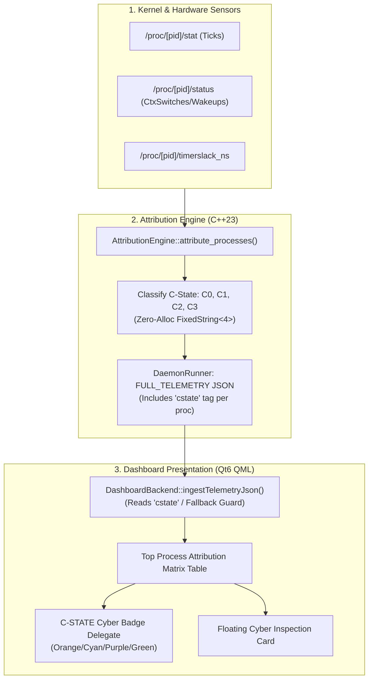

# REF-ARCH-067: Process C-State Classification Algorithm & Cyber Badge Visual Architecture

- **Document ID**: `REF-ARCH-067`
- **Related Architecture**: [`REF-ARCH-002`](ARCH-002-process-analyzer-procfs.md), [`REF-ARCH-037`](ARCH-037-btop-style-power-matrix-dashboard.md), [`REF-ARCH-066`](ARCH-066-matrix-dashboard-two-column-legend-and-font-scaling.md)
- **Related Requirements**: [`REF-REQ-090`](../requirements/REQ-090-process-cstate-affinity-badge-telemetry.md)
- **Status**: Approved
- **Date**: 2026-09-21

---

## 1. System Context & Architectural Ingestion Flow

The process C-State affinity mechanism operates at the boundary between attribution analysis and the QML presentation layer:



---

## 2. Classification Algorithm (`core::FixedString<4>`)

To avoid runtime heap allocations, `ProcessAttributedPower` in `src/core/types.hpp` incorporates:
```cpp
core::FixedString<4> cstate_affinity{"C3"};
```

The deterministic heuristic implemented in `src/policy/attribution_engine.cpp` is:
```cpp
if (pap.cpu_watts >= 0.25 || d.delta_cpu_ticks > 15) {
    pap.cstate_affinity = "C0"; // Active Core Execution
} else if (pap.wakeups_per_sec >= 30 || pap.wakeup_tax_watts >= 0.15 || pap.timerslack_ns < 50000) {
    pap.cstate_affinity = "C1"; // Light Idle / Shallow Wakeup Storm
} else if (pap.wakeups_per_sec >= 5 || pap.io_watts >= 0.05) {
    pap.cstate_affinity = "C2"; // Moderate Idle / I/O Wait
} else {
    pap.cstate_affinity = "C3"; // Deep Sleep Retention
}
```

---

## 3. UI Matrix Column & Badge Layout

In `src/ui/qml/DashboardWindow.qml`:
- Column Header layout:
  ```qml
  Text { text: "TIER"; color: root.textDim; font.pixelSize: 12; font.bold: true; Layout.preferredWidth: 55; clip: true }
  Text { text: "C-STATE"; color: root.textDim; font.pixelSize: 12; font.bold: true; Layout.preferredWidth: 54; clip: true }
  Text { text: "PRIMARY HARDWARE MECHANISM"; color: root.textDim; font.pixelSize: 12; font.bold: true; Layout.fillWidth: true; clip: true }
  ```
- Delegate implementation:
  ```qml
  Rectangle {
      Layout.preferredWidth: 54
      height: 22
      radius: 3
      readonly property string cs: modelData["cstate"] !== undefined ? modelData["cstate"] : "C3"
      color: cs === "C0" ? "#361c0a" : (cs === "C1" ? "#132738" : (cs === "C2" ? "#1f1d38" : "#0d2b1d"))
      border.color: cs === "C0" ? root.colOrange : (cs === "C1" ? root.colCyan : (cs === "C2" ? root.colPurple : root.colGreen))
      border.width: 1
      Text {
          anchors.centerIn: parent
          text: parent.cs
          color: parent.cs === "C0" ? root.colOrange : (parent.cs === "C1" ? root.colCyan : (parent.cs === "C2" ? "#c084fc" : root.colGreen))
          font.pixelSize: 11
          font.bold: true
          font.family: "Monospace"
      }
  }
  ```

---

## 4. Verification & Oracle Gate Standards (`REF-TEST-054`)

1. **Classification Correctness**: Assert that high-compute processes ($\ge 0.25\,W$) are classified as `C0`, wakeup storms ($\ge 30\,\text{w/s}$) as `C1`, intermediate wait as `C2`, and idle processes ($< 5\,\text{w/s}$) as `C3`.
2. **QML Layout & Parsing Integrity**: Ensure QML source contains the `C-STATE` column header, 54px preferred width, badge container with distinct color mappings, and fallback handling.
3. **Throughput Benchmark**: Validate that 10,000 process classifications execute in $< 500\,\mu s$ ($< 50\,\text{ns}$/op).
