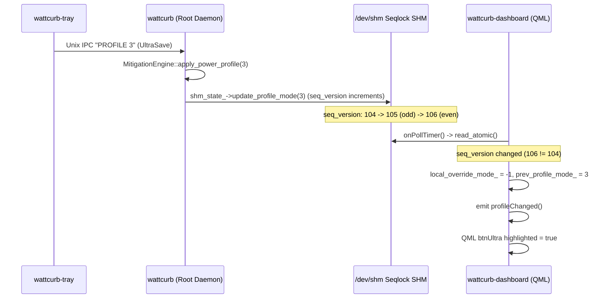

# REF-ARCH-068: Seqlock-Driven Multi-Client Power Profile Synchronization Architecture

## 1. Overview & Coherence Model
WattCurb uses a shared memory segment ([`WattCurbSharedState`](file:///home/jedclub/Develop/WattCurb/src/ipc/tray_shared_state.hpp)) mapped at `/dev/shm/wattcurb_state.shm` to publish daemon state to zero-overhead consumer processes (`wattcurb-tray`, `wattcurb-dashboard`).

To guarantee bi-directional coherence when profile mode is changed by any actor:


---

## 2. Component Specifications

### 2.1. Seqlock Atomic Update in `WattCurbSharedState`
```cpp
void update_profile_mode(uint8_t mode) noexcept {
    uint64_t ver = __atomic_load_n(&seq_version, __ATOMIC_RELAXED);
    __atomic_store_n(&seq_version, ver + 1, __ATOMIC_RELEASE); // Writer busy (odd)
    power_profile_mode = mode;
    __atomic_store_n(&seq_version, ver + 2, __ATOMIC_RELEASE); // Writer stable (even)
}
```
Ensures that any concurrent reader (`read_atomic`) either retries while the sequence is odd or observes the updated `power_profile_mode` cleanly with memory barriers.

### 2.2. Coherence State Machine in `DashboardBackend`
The backend tracks:
- `latest_state_.power_profile_mode`: Latest authoritative mode from Daemon.
- `local_override_mode_`: Temporary speculative mode set during dashboard UI clicks (`-1` when idle).
- `prev_profile_mode_`: Previously emitted profile mode for deduplicated delta notification.

Coherence transitions on every poll iteration:
1. **Poll & Seqlock Read**:
   - `shm_state_->read_atomic(cur)` reads atomic state.
   - If `cur.seq_version != prev_seq_version_` OR `cur.power_profile_mode != latest_state_.power_profile_mode`:
     - `state_changed = true`.
     - `latest_state_ = cur`.
2. **Override Clearance**:
   - If `local_override_mode_ >= 0`:
     - If `cur.power_profile_mode == local_override_mode_` $\rightarrow$ Daemon confirmed local request $\rightarrow$ `local_override_mode_ = -1`.
     - If `cur.power_profile_mode != prev_profile_mode_` $\rightarrow$ External actor changed mode $\rightarrow$ `local_override_mode_ = -1`.
3. **Signal Notification**:
   - `int effective_mode = powerProfileMode();`
   - If `effective_mode != prev_profile_mode_`:
     - `prev_profile_mode_ = effective_mode;`
     - `emit profileChanged();`
     - QML bindings for `backend.powerProfileMode` update reactively.

---

## 3. Telemetry Ingestion Coherence
When `queryDaemonTelemetry()` receives `FULL_TELEMETRY` JSON:
- Parses `"profile_mode"`.
- If valid, updates `latest_state_.power_profile_mode`.
- Clears `local_override_mode_` if matched or overridden.
- Dispatches `emit profileChanged()` if changed.

---

## 4. Verification Plan
- Unit test [`REF-TEST-055`](file:///home/jedclub/Develop/WattCurb/tests/test_units.cpp):
  1. External change simulation via `update_profile_mode()`.
  2. Verification that `DashboardBackend::runPollIteration()` emits `profileChanged` and sets `powerProfileMode()`.
  3. Speculative override resolution verification.
  4. Benchmark execution latency $< 50\text{ ns/op}$.
