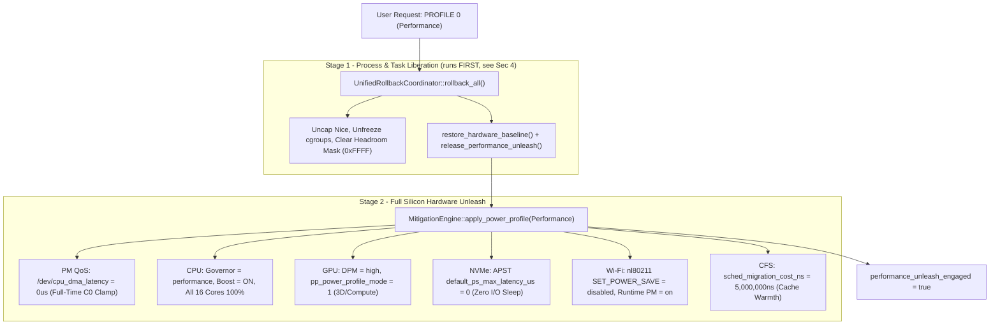

# REF-ARCH-069: Ultimate Performance Unleash Full-Silicon Actuation Architecture

## 1. Architectural Topology
The Ultimate Performance Unleash pipeline expands the root daemon's profile actuation engine across six distinct hardware and kernel domains:



> **Stage order is load-bearing.** Stage 1 reaches `release_performance_unleash()`,
> so running it after Stage 2 would undo the entire unleash in the same tick.
> See Sec 4.

---

## 2. Interface Design & Baseline Preservation

### 2.1. Extended Hardware Baseline Tracking
The internal `HardwareBaseline` structure in [`src/policy/mitigation_engine.hpp`](file:///home/jedclub/Develop/WattCurb/src/policy/mitigation_engine.hpp) is extended to track performance-mode modifications:

```cpp
struct HardwareBaseline {
    // Existing baseline fields...
    bool performance_pm_qos_active{false};
    int performance_pm_qos_fd{-1};
    int gpu_power_profile_mode_baseline{-1};
    bool gpu_power_profile_mode_modified{false};
    uint32_t nvme_apst_latency_baseline_us{100000};
    bool nvme_apst_modified{false};
    uint64_t sched_migration_cost_baseline_ns{500000};
    bool sched_migration_cost_modified{false};
    bool wifi_power_save_baseline{true};
    bool wifi_power_save_disabled{false};
    bool performance_unleash_engaged{false};
};
```

Every domain carries **both** a captured baseline value *and* a `*_modified`
flag. The flag is the authority for demotion: `restore_hardware_baseline()` may
only write a knob WattCurb itself actuated. Writing a constant "default" back
into hardware the daemon never touched would silently overwrite the user's own
configuration (for example, a laptop that deliberately runs with 802.11 power
save already off).

`performance_unleash_engaged` records which actuation ran **last**, and is the
privilege-independent observable that anchors the ordering invariant in Sec 4.

### 2.2. Atomic PM QoS Zero-Latency Controller
```cpp
void set_performance_pm_qos(bool enable) noexcept {
    if (enable) {
        if (s_hardware_baseline.performance_pm_qos_fd < 0) {
            int fd = ::open("/dev/cpu_dma_latency", O_RDWR | O_CLOEXEC);
            if (fd >= 0) {
                int32_t latency = 0; // 0 us target latency -> clamp to C0
                if (::write(fd, &latency, sizeof(latency)) == sizeof(latency)) {
                    s_hardware_baseline.performance_pm_qos_fd = fd;
                    s_hardware_baseline.performance_pm_qos_active = true;
                } else {
                    ::close(fd);
                }
            }
        }
    } else {
        if (s_hardware_baseline.performance_pm_qos_fd >= 0) {
            ::close(s_hardware_baseline.performance_pm_qos_fd);
            s_hardware_baseline.performance_pm_qos_fd = -1;
            s_hardware_baseline.performance_pm_qos_active = false;
        }
    }
}
```

### 2.3. GPU 3D/Compute Power Profile Mode Actuator
The amdgpu `pp_power_profile_mode` node is a table whose active row is marked
with `*`. The bootstrap probe parses that row so demotion restores the real
pre-actuation mode rather than a hardcoded `0`:

```cpp
// Rows look like "  1   3D_FULL_SCREEN*:" - '*' marks the active mode.
[[nodiscard]] int read_gpu_power_profile_mode() noexcept;

bool set_gpu_power_profile_mode(int mode_id) noexcept {
    // ... write mode_id to /sys/class/drm/card{1,0}/device/pp_power_profile_mode
    s_hardware_baseline.gpu_power_profile_mode_modified = true;
}

bool restore_gpu_power_profile_mode_baseline() noexcept {
    if (!s_hardware_baseline.gpu_power_profile_mode_modified) return true;
    const int baseline = s_hardware_baseline.gpu_power_profile_mode_baseline;
    set_gpu_power_profile_mode(baseline >= 0 ? baseline : 0); // 0 only as fallback
    s_hardware_baseline.gpu_power_profile_mode_modified = false;
    return true;
}
```

### 2.4. NVMe APST Zero-Latency Actuator
```cpp
bool set_nvme_apst_max_latency(uint32_t max_latency_us) noexcept {
    int fd = ::open("/sys/module/nvme_core/parameters/default_ps_max_latency_us", O_WRONLY | O_CLOEXEC);
    if (fd >= 0) {
        char buf[32];
        int len = std::snprintf(buf, sizeof(buf), "%u\n", max_latency_us);
        (void)::write(fd, buf, static_cast<size_t>(len));
        ::close(fd);
        return true;
    }
    return false;
}
```

### 2.5. Kernel CFS Migration Cost Tuner
```cpp
bool set_sched_migration_cost(uint64_t cost_ns) noexcept {
    int fd = ::open("/proc/sys/kernel/sched_migration_cost_ns", O_WRONLY | O_CLOEXEC);
    if (fd >= 0) {
        char buf[32];
        int len = std::snprintf(buf, sizeof(buf), "%lu\n", cost_ns);
        (void)::write(fd, buf, static_cast<size_t>(len));
        ::close(fd);
        return true;
    }
    return false;
}
```

### 2.6. Zero-Fork Wi-Fi Power Save via nl80211 Generic Netlink
802.11 power save has no sysfs knob; the canonical userspace path is
`iw dev <iface> set power_save off`. Shelling out to it is **prohibited on this
path**: a single `::system()` call was measured at **~4.2 ms** (fork + exec of
`/bin/sh`), consuming 84% of the < 5 ms unified rapid-rollback Oracle Gate
budget ([`REF-TEST-020`](file:///home/jedclub/Develop/WattCurb/tests/test_units.cpp))
and violating the zero-allocation / zero-fork daemon doctrine (AGENTS.md Sec 9).

WattCurb therefore speaks nl80211 directly, from stack buffers, with no heap and
no process creation (~50 us per round trip):

```cpp
// Cached CTRL_CMD_GETFAMILY resolution of the dynamic nl80211 family id.
[[nodiscard]] uint16_t nl80211_family_id(int fd) noexcept;

// NL80211_CMD_SET_POWER_SAVE + NL80211_ATTR_PS_STATE, ACK-verified.
[[nodiscard]] bool nl80211_set_power_save(const char* ifname, bool enable) noexcept;

// NL80211_CMD_GET_POWER_SAVE - permitted to unprivileged callers, so the
// bootstrap probe can capture the user's real pre-actuation state.
[[nodiscard]] bool nl80211_get_power_save(const char* ifname, bool* out_enabled) noexcept;
```

Design constraints:
- The generic-netlink socket sets `SO_RCVTIMEO` to a 100 ms hard ceiling, so a
  wedged kernel socket can never stall the rapid-rollback path.
- Netlink alignment is computed locally (`nl_align`) rather than through the
  kernel `NLA_ALIGN` / `NLA_HDRLEN` macros, which fold a signed
  `~(NLA_ALIGNTO - 1)` into `size_t` arithmetic and trip `-Wsign-conversion`.
- The ACK arrives as `NLMSG_ERROR` carrying `error == 0`; anything else is
  reported as a failed actuation, so the `*_modified` flag stays clean when the
  daemon lacks `CAP_NET_ADMIN`.

### 2.7. Hardware Actuation Sandbox (Host Isolation)
Every actuator that mutates live kernel, sysfs or process state funnels through
a single set of wrappers:

| Wrapper | Covers | Sandboxed result |
| :--- | :--- | :--- |
| `hw_open_write()` | 37 sysfs / procfs / `/dev` write opens | `-1` (identical to an unprivileged caller) |
| `hw_setpriority()` | CFS nice modulation | `-1` |
| `hw_sched_setaffinity()` | Core pinning / headroom masks | `-1` |
| `hw_sched_setscheduler()` | `SCHED_IDLE` / `SCHED_BATCH` demotion | `-1` |
| `hw_ioprio_set()` | Block I/O priority | `-1` |
| `hw_system()` | Backgrounded desktop / `iw` helpers | `0` (the shell's own result for `"... &"`) |
| `nl80211_set_power_save()` | 802.11 power save | `false` |

`MitigationEngine::set_actuation_sandbox(true)` engages it; production default is
OFF and the branch is a single predictable load on an already syscall-bound path.

This exists because the Oracle Gate genuinely actuated the developer's machine:
`/dev/cpu_dma_latency` is mode `0660 root:audio`, so on any host whose test user
is in the `audio` group the suite really did clamp every core to $C_0$, and as
root it additionally rewrote NVMe APST, the CFS migration cost, 802.11 power save
and the nice level of the live audio daemon. `REF-TEST-056` now asserts the
sandbox is engaged before its first actuation, so the isolation cannot regress
silently.

Two further couplings to the live host were removed alongside it:
- `DashboardBackend::mapSharedMemory()` honours `WATTCURB_TEST_NO_DAEMON_SHM`.
  Without it the backend mmaps a **running daemon's** `/dev/shm/wattcurb_state.shm`
  and overwrites the synthetic telemetry the suite just ingested, so assertions on
  the derived power shares depended on the machine's instantaneous draw.
- The Seqlock delta gate no longer uses `prev_seq_version_ == 0` as its first-poll
  sentinel (see [`REF-ARCH-051`](file:///home/jedclub/Develop/WattCurb/docs/architecture/ARCH-051-dashboard-matrix-profiling-scopes-and-zero-copy-ingestion.md)).

### 2.8. Shared Wireless Interface Discovery
REQ-092.5 specifies `iw dev <iface>`, i.e. a **dynamically discovered**
interface. A single `detect_wireless_ifname()` helper scans
`/sys/class/net/*/wireless` and is shared by the power-save actuator and both
TX-power actuators, so hosts whose radio is not literally named `wlan0`
(`wlp1s0`, `wlp2s0`, `wlp3s0`, ...) are handled uniformly.

---

## 3. Demotion & Clean Rollback Guarantee
Demotion has exactly one implementation, `MitigationEngine::release_performance_unleash()`,
invoked from every non-Performance branch of `apply_power_profile()` and from
`restore_hardware_baseline()`. Each step is individually `*_modified`-guarded:

| # | Step | Guard | Restores to |
| :-- | :--- | :--- | :--- |
| 1 | Close PM QoS | `performance_pm_qos_fd >= 0` | `/dev/cpu_dma_latency` released; cores resume deep $C_1/C_2/C_3$ sleep |
| 2 | GPU profile mode | `gpu_power_profile_mode_modified` | Captured active row (`0` only as fallback) |
| 3 | NVMe APST module parameter | `nvme_apst_modified` | Captured `default_ps_max_latency_us` |
| 3b | NVMe controller runtime PM | `nvme_power_control_modified` | Per-controller captured `auto` / `on` string |
| 4 | Wi-Fi power save | `wifi_power_save_disabled` | Captured `wifi_power_save_baseline` |
| 5 | CFS migration cost | `sched_migration_cost_modified` | Captured `sched_migration_cost_ns` |
| 6 | Unleash flag | - | `performance_unleash_engaged = false` |

The Wi-Fi override flag is cleared **unconditionally** after step 4, so the
daemon stops holding an override even when the captured baseline was itself
"power save disabled".

---

## 4. Transition-Path Ordering Invariant (REF-REQ-092.2)
`MitigationEngine::evaluate_and_actuate()` reaches `rollback_all()`, which calls
`restore_hardware_baseline()`, which calls `release_performance_unleash()`.
Consequently the rollback **must precede** the actuation:

```cpp
if (old_profile != target_profile) {
    if (target_profile == Performance || target_profile == Balanced) {
        rollback_all();          // release process + hardware state first
    }
    apply_power_profile(target_profile);   // then actuate the new profile
    // ... PowerSaver / UltraEndurance post-steps
}
```

Applying first and rolling back after makes the rollback undo the entire
full-silicon unleash in the same tick, leaving Performance mode actuated in name
only (and, for Balanced, resetting the profile to the bootstrap baseline).

`performance_unleash_engaged` makes this observable without privileges: it
records the last actuation to run, whether or not the underlying sysfs writes
were permitted. [`REF-TEST-056`](file:///home/jedclub/Develop/WattCurb/tests/test_units.cpp)
drives `PowerSaver -> Performance -> Balanced` through `evaluate_and_actuate()`
and asserts the flag is engaged after the Performance transition and released
after demotion.
