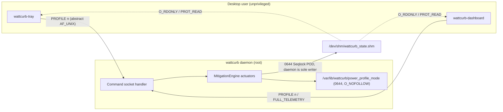

# REF-ARCH-070: Privilege Boundary & Actuation Isolation Architecture

## 1. Trust Boundaries



The command socket is the **only** channel crossing the boundary inward. Nothing
root-owned lives under `/home`, and nothing user-writable is consumed as
instructions.

## 2. Daemon-Owned Persistence
`persist_profile_mode()` / `load_profile_mode()` in `daemon_runner.cpp` replace
three inline `open(..., 0666)` + `fchmod(0666)` sequences:

```cpp
constexpr const char* PROFILE_STATE_PATH = "/var/lib/wattcurb/power_profile_mode";

(void)::mkdir(PROFILE_STATE_DIR, 0755);            // StateDirectory= covers systemd
int fd = ::open(PROFILE_STATE_PATH,
                O_WRONLY | O_CREAT | O_TRUNC | O_NOFOLLOW | O_CLOEXEC, 0644);
```

`O_NOFOLLOW` is defence-in-depth (only root can create entries in the state
directory); the substantive change is that the path is no longer user-owned.

## 3. Wireless Actuation Without a Shell
`nl80211_set_tx_power()` issues `NL80211_CMD_SET_WIPHY` with
`NL80211_ATTR_WIPHY_TX_POWER_SETTING` (`AUTOMATIC` / `LIMITED`) and
`..._TX_POWER_LEVEL`, reusing the socket, family-resolution and attribute
helpers introduced for power save in
[`REF-ARCH-069`](file:///home/jedclub/Develop/WattCurb/docs/architecture/ARCH-069-ultimate-performance-unleash-architecture.md).
The interface name is now only ever passed to `if_nametoindex()`, never to a shell.

## 4. Privileged Desktop Bridge
`detect_desktop_session()` scans `/run/user/*`, skips uids below 1000, and
prefers a runtime directory containing a `wayland-*` socket, falling back to the
first candidate. It yields uid, gid, runtime dir and display name, all of which
were previously hardcoded to 1000 / `wayland-0`.

`execute_user_desktop_cmd()` additionally:
- refuses a body containing `'`, which would escape the `sh -c '%s'` quoting;
- refuses to execute a truncated command (`snprintf` return checked against the
  buffer size), since truncation can itself unbalance the quoting.

## 5. Oracle Gate Isolation
Two independent mechanisms, both engaged by the test harness:

| Mechanism | Prevents |
| :--- | :--- |
| `MitigationEngine::set_actuation_sandbox(true)` | the suite actuating the host (C0 clamp, NVMe APST, CFS tuning, Wi-Fi, renicing the audio daemon) |
| `WATTCURB_TEST_NO_DAEMON_SHM` | the suite *observing* a live daemon via state shm or the abstract command socket |

Known remaining ambient couplings are recorded in
[`REF-RES-026`](file:///home/jedclub/Develop/WattCurb/docs/research/RES-026-privilege-boundary-audit.md) §3.
