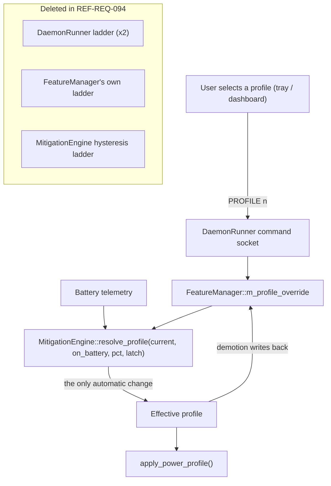

# REF-ARCH-071: Watt-Reactive Icon Rasteriser & Single Profile Authority

## 1. Profile Authority Topology



Previously each box in *Deleted* ran its own thresholds, and the engine's ladder
re-derived a profile every cycle from battery percentage because the daemon never
propagated the user's choice into it. Now one pure function decides, and the
caller supplies the latch:

```cpp
// core/types.hpp - shared so no policy site needs the engine header
struct ProfileDemotionLatch { bool crossed_30{false}; bool crossed_20{false}; };

PowerProfileMode MitigationEngine::resolve_profile(
    PowerProfileMode current, bool on_battery, double battery_pct,
    ProfileDemotionLatch& latch) noexcept;
```

Ordering inside the function matters: rearm, then AC bypass, then the 5% floor,
then 20%, then 30%. The 20% branch also consumes `crossed_30`, so a single large
drop cannot demote twice.

## 2. Audio Continuity Path (REF-REQ-096)

```
every evaluation cycle
   audit_and_heal_audio_stack()
     ├─ refresh_audio_stream_state()      /proc/asound/card*/pcm*p/sub*/status
     │                                     -> active? + owner_pid[]
     ├─ set_audio_latency_floor(active)   /dev/cpu_dma_latency @ 100 us (own fd)
     ├─ codec power_save -> 0 while active, restored when idle
     └─ existing nice -19 / all-core affinity healing
```

`is_immune_process()` consults the owner list first, so immunity follows the
running stream rather than a name allowlist. The audio descriptor is independent
of the Performance-mode clamp: the kernel takes the minimum across holders, so
`min(0 us, 100 us)` in Performance and `100 us` everywhere else, with no
interaction logic and no ordering hazard.

## 3. Icon Rasteriser

`src/tray/icon_renderer.{hpp,cpp}` draws the icon rather than naming it, because
a themed name cannot express a continuous value.

### 2.1 Pipeline
```
system watts ─▶ watt_ratio(profile, W) ─▶ t∈[0,1] ─▶ watt_color(t) ─▶ badge fill
battery %, charging ──────────────────────────────▶ frame_color()  ─▶ shell + level bar
```

### 3.2 Layout priority
Geometry is authored in a 100x100 design space and scaled per requested size, so
22 / 32 / 48 px all render from one definition.

**There is no container.** Two earlier revisions drew an enclosing battery
outline and fitted the glyph inside it. That outline was the brightest and
largest element in the tile while carrying the least information, and it boxed
the glyph down to roughly half the available height. The glyph now owns the tile;
charge, charging state and the low warning ride on a slim rail along the bottom
edge, which reads at 22 px and never competes with the glyph.

| Element | Design-space extent | Notes |
| :--- | :--- | :--- |
| Profile glyph | centre (50, 42), half-size 42 | owns the tile |
| Charge rail | x 6..94, y 86..95 | track at 0.22 alpha, lit portion at full strength, floored at 7% width so a nearly empty battery still shows a stub |

The rail carries all three battery facts through `frame_color()`: bright blue
while charging, white above 30%, fading white to red below it.

### 3.3 Primitives

| Primitive | Use |
| :--- | :--- |
| `fill_path()` | anti-aliased even-odd scanline fill; 4 sub-scanlines give vertical AA, fractional span ends give horizontal AA |
| `stroke_round_rect()` | battery shell - outer and reversed inner contour in one even-odd path, so both edges anti-alias (rather than clearing the interior pixel by pixel) |
| `fill_ring()` | gauge track and filled arc |
| `fill_bar()` | needle, snowflake spokes, leaf midrib |

### 3.4 Glyphs
The first revision drew each glyph as a flat polygon fill, which read as a
triangle, a lens and a bundle of sticks. Each is now built from curves and
tapered strokes:

| Glyph | Construction |
| :--- | :--- |
| Rocket | semicircular nose cap flowing into a tapered fuselage, swept delta fins, punched porthole, tapered exhaust plume |
| Gauge | unlit track at 34% luminance of the badge colour, lit arc to `t`, end ticks, and a needle tapered from hub to tip; `REF-TEST-058` measures the deflection by centroid |
| Leaf | asymmetric blade (outer flank fuller than the inner), stem past the base, midrib dimmed to 40% rather than near-black so it reads as a vein, not a crack |
| Snowflake | six tapered spokes, two barb pairs per arm, hexagonal hub - straight radial geometry, deliberately the inverse of the leaf's curves |

`fill_taper()` (a quad with independent end widths) is what separates a needle,
a spoke and a stem from a uniform stick.

### 3.5 Transport
Served over SNI `IconPixmap` as ARGB32 in network byte order at 22, 32 and 48 px.
`IconName` returns an empty string, since a non-empty name outranks `IconPixmap`
in Plasma. The property is declared `EMITS_CHANGE` (it was `CONST`), and the
existing `NewIcon` emission on state change drives the refresh.

### 3.6 Caching
Hosts re-read the property more often than the icon changes. A key of
`(profile, watt ratio quantised to 1/64, battery %, charging)` guards the
rasterisation, so telemetry jitter does not force a redraw that would be
invisible. Function-local statics are sound here: the tray is a singleton process
on a single sd-bus loop.
