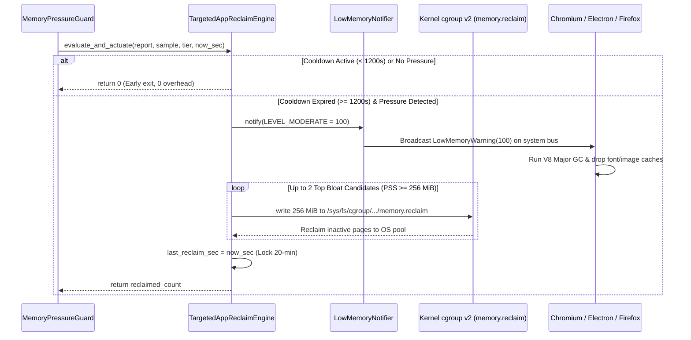

# REF-ARCH-082: Targeted App Reclaim & Smart GC Engine Architecture

## 1. Architectural Positioning

The **Targeted App Reclaim Engine** (`wattcurb::policy::TargetedAppReclaimEngine`) acts as a specialized non-destructive memory recovery unit within the `MemoryPressureGuard` subsystem.

```
+-------------------------------------------------------------------------+
|                         MemoryPressureGuard                             |
|  +-------------------------------------------------------------------+  |
|  |             Kernel PSI Trigger (EPOLLPRI) / Sample Gate           |  |
|  +---------------------------------+---------------------------------+  |
|                                    | (when pressure detected)           |
|                                    v                                    |
|  +-------------------------------------------------------------------+  |
|  |           TargetedAppReclaimEngine (REF-ARCH-082)                |  |
|  |                                                                   |  |
|  |   [1. Cooldown Gate]   now_sec >= last_reclaim_sec + 1200s ?      |  |
|  |   [2. Candidate Gate]  PSS >= 256 MiB & SafetyTier != Immune      |  |
|  |   [3. D-Bus Signal]    LowMemoryNotifier::notify(LEVEL_MODERATE)   |  |
|  |   [4. Cgroup Actuator] MitigationEngine::apply_memory_reclaim()   |  |
|  |   [5. State Lock]      last_reclaim_sec = now_sec                 |  |
|  +-------------------------------------------------------------------+  |
+-------------------------------------------------------------------------+
```

---

## 2. Memory Layout & Zero-Cost Abstraction

To ensure compliance with WattCurb's strict sub-milliwatt, zero-allocation runtime constraints:
1. **Contiguous Cache Line Alignment**:
   ```cpp
   struct alignas(64) TargetedReclaimTelemetry {
       uint64_t last_reclaim_sec{0};
       uint64_t total_reclaim_bytes{0};
       uint32_t total_reclaim_count{0};
       uint32_t last_reclaimed_pids[2]{0, 0};
   };
   ```
2. **Zero Heap Allocations**:
   Candidate selection scans `report.top_processes` using fixed stack-allocated arrays of size 2. No `std::vector` reallocations or dynamic memory allocations occur on the execution path.
3. **Pure Predicates for Deterministic Testing (`REF-TEST-089`)**:
   * `is_pressure_satisfied()`: Pure boolean evaluating PSI, MemAvailable, SwapFree, and Tier.
   * `is_cooldown_expired()`: Pure cooldown duration validation.
   * `is_eligible_candidate()`: Process safety tier and footprint verification.

---

## 3. Two-Stage Actuation Pipeline



---

## 4. Safety Invariants & Boundary Guarantees

1. **Non-Halting / Zero-Kill**: No `SIGKILL`, `SIGTERM`, or `SIGSTOP` is ever issued. The entire sequence is non-destructive.
2. **No Oscillating Swapping**: Capped at 256 MiB per candidate and locked for 20 minutes, preventing disk I/O thrashing.
3. **Desk-Safe Immunity**: Critical window managers and audio pipelines are unconditionally bypassed.
