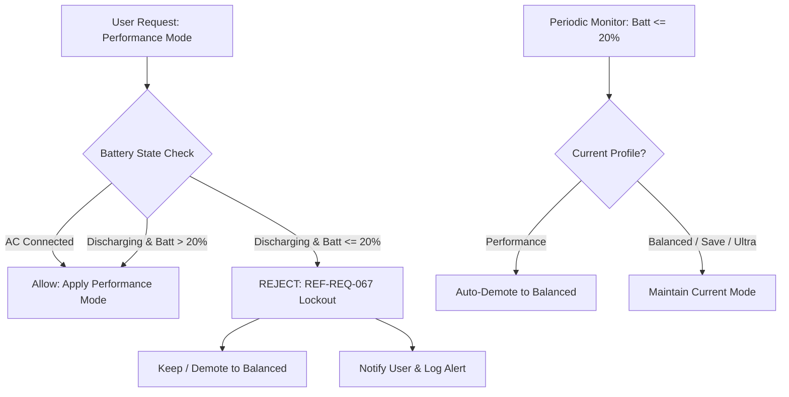

# [REF-REQ-067] Battery Low Performance Mode Lockout Specification

## 1. Context & Motivation

When a laptop operates on a discharging lithium-ion/polymer battery below 20% state of charge (SoC):
1. **Internal Impedance Spike ($R_{\text{int}}$)**: The equivalent series resistance (ESR) of the battery cells rises steeply as chemical potential drops.
2. **Voltage Sag & Sudden Brownout**: Drawing peak CPU/GPU transient currents (4.1GHz Boost, 25W~30W TDP) induces severe instantaneous voltage sag ($V_{\text{sag}} = I_{\text{peak}} \times R_{\text{int}}$), triggering catastrophic system brownout or hardware emergency cut-off.
3. **Cell Health Preservation**: High C-rate discharges at low SoC accelerate chemical anode degradation and cell swelling.
4. **Runtime Predictability**: Extreme discharge rates at low battery drain remaining battery in minutes.

Therefore, WattCurb enforces a strict, hardware-level **Performance Mode Lockout** whenever the device is operating on battery power at or below 20% capacity.

---

## 2. Functional Requirements

### 2.1 Activation Condition
The lockout invariant is activated if and only if:
$$\text{is\_battery\_discharging} == \text{true} \quad \land \quad \text{battery\_capacity\_percent} \le 20$$

When AC external power is connected (charging or passthrough), the lockout is inactive, permitting full performance exploitation.

### 2.2 Rejection of User Performance Request
- When an IPC command `PROFILE 0` (Performance) is received via socket while lockout is active:
  - The daemon **must reject** the transition with an explicit error response:
    `"ERROR: Performance mode is prohibited when battery <= 20% (REF-REQ-067)\n"`.
  - The daemon logs an alert to `EventLogger`:
    `[ALERT] Performance mode switch rejected: Battery capacity <= 20%`.
  - The previous power profile remains intact and unaltered.

### 2.3 Automatic Profile Demotion (Active Protection)
- If the system is currently running in `Performance` mode and the battery level drops to $\le 20\%$ while discharging:
  - The daemon's observation cycle (`process_observation_cycle`) **must automatically demote** the profile to `Balanced` mode.
  - The daemon updates sysfs hardware governors, frequencies, and platform profiles immediately to safe balanced levels.
  - An event is logged:
    `[ALERT] Performance mode automatically demoted to Balanced: Battery capacity <= 20% (REF-REQ-067)`.
  - The cached state file (`~/.cache/power_profile_mode`) is safely updated to `balanced`.

### 2.4 Multi-Layer Defense-in-Depth (UI, CLI, Daemon)
- **Root Daemon (`DaemonRunner`, `FeatureManager`)**: Authoritative gatekeeper preventing any execution of performance hardware parameters.
- **UI Dashboard (`DashboardWindow.qml`, `DashboardBackend`)**:
  - The Performance button is visibly dimmed and disabled when lockout condition is met.
  - Interactive tooltip indicates: `"배터리 20% 이하에서는 배터리 보호를 위해 고성능 모드를 사용할 수 없습니다 (REF-REQ-067)"`.
- **System Tray (`TrayClient`)**:
  - Profile cycling skips mode 0 (`Performance`) directly to mode 1 (`Balanced`).
  - Context menu selection of Performance displays an inline rejection warning or defaults to Balanced.
- **CLI (`power-profile-manager`)**:
  - Invoking `power-profile-manager performance` evaluates BAT0 capacity and returns code 1 with user notification if $\le 20\%$.

---

## 3. Architecture & Interface Design (`REF-ARCH-043`)

---

## 4. Verification & Oracle Gate Standards (`REF-TEST-032`)

1. **Deterministic IPC Rejection**:
   - Issue `PROFILE 0` when simulated battery is discharging at 19%. Assert return code is error and active profile remains non-zero.
2. **Deterministic Periodic Demotion**:
   - Initialize in `Performance` mode with 50% battery. Trigger telemetry update with 18% discharging. Assert active profile changes to `Balanced`.
3. **Zero-Allocation Invariant**:
   - Condition evaluation in `evaluate_and_actuate` and `process_observation_cycle` must execute with 0 heap allocations and < 50ns latency.
