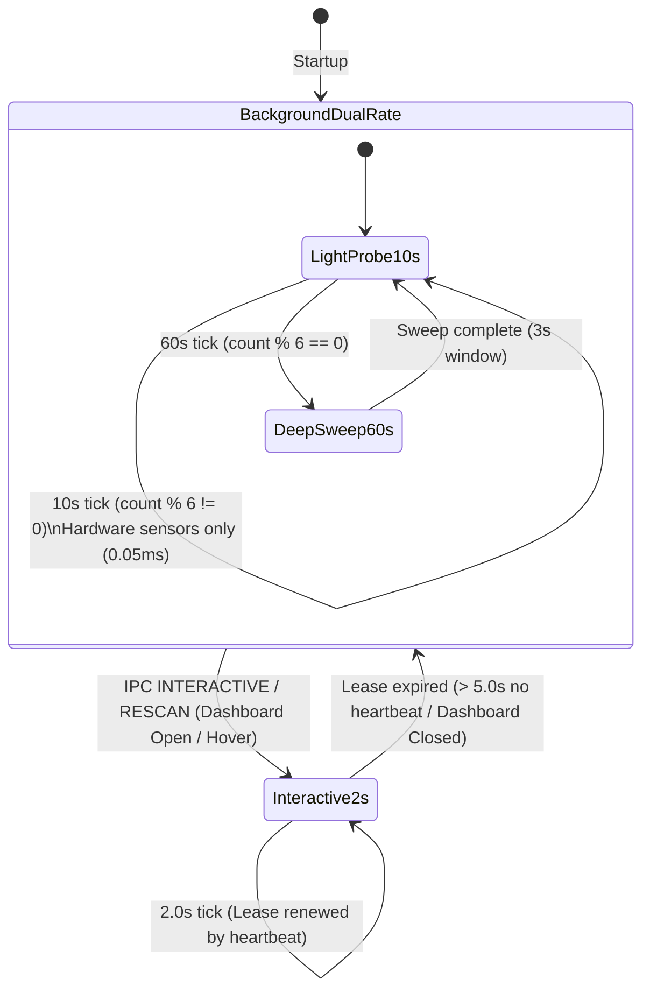

# [REF-REQ-068] Adaptive 3-Tier Telemetry Cadence Specification

## 1. Context & Motivation

Continuously running full-system process traversals every few seconds introduces unnecessary CPU wakeups, violating the daemon's core Zero-Wakeup mission. Conversely, a rigid 60-second polling cadence degrades interactive user experience when the user explicitly opens the diagnostic GUI dashboard or hovers over the system tray.

To resolve this trade-off, WattCurb adopts an **Adaptive 3-Tier Telemetry Cadence**:
1. **Interactive High-Cadence Mode (2.0s)**: Engaged exclusively on-demand while the user is actively viewing telemetry (GUI dashboard open, tray hover, or explicit rescan).
2. **Background Coarse Telemetry (10.0s)**: Ultra-lightweight hardware sensor sampling with zero `/proc` process directory traversals (< 0.05ms active CPU time).
3. **Periodic Deep Attribution Sweep (60.0s)**: Exhaustive process snapshot, WDI attribution ranking, and mitigation policy evaluation conducted once per minute over a 3.0s observation window.

---

## 2. Functional Requirements

### 2.1 Cadence Definitions

| Cadence Tier | Interval | Scope | Target CPU Active Time |
| :--- | :--- | :--- | :--- |
| **Tier 1: Interactive** | **2.0 seconds** | Full hardware telemetry + full process attribution + UI streaming | < 0.1% CPU |
| **Tier 2: Background Light** | **10.0 seconds** | Hardware sensors only (RAPL, GPU, Battery, C-States). **Zero `/proc` process traversal** | < 0.005% CPU (< 0.05ms) |
| **Tier 3: Background Deep** | **60.0 seconds** | Full hardware telemetry + 300+ process snapshot + WDI matrix update | < 0.03% average CPU |

### 2.2 Interactive Lease Controller (`REF-ARCH-044`)
- When the GUI dashboard (`wattcurb-dashboard`) is active or tray hover occurs, client software issues an IPC datagram: `INTERACTIVE\n` or `HEARTBEAT\n`.
- The root daemon registers an **Interactive Lease** valid for 5.0 seconds from the latest received heartbeat:
  $$\text{lease\_expiry} = \text{CLOCK\_MONOTONIC} + 5.0\,\text{sec}$$
- While the lease is active:
  - `timerfd` interval is dynamically programmed to **2.0 seconds**.
  - Every timer tick executes a complete Tier 1 observation cycle.
- When the lease expires (e.g., GUI dashboard closed):
  - `timerfd` interval is immediately re-armed to **10.0 seconds**.
  - The daemon transitions back to background dual-rate operation (Tier 2 & Tier 3).

### 2.3 Background Dual-Rate Execution (10s Light / 60s Deep)
- In the background state, `timerfd` fires every **10.0 seconds** (`tick_count++`):
  - **Every 10s (`tick_count % 6 != 0`)**: Tier 2 Ultra-Lightweight Probe.
    - Reads `/sys/class/power_supply/BAT0/uevent`, RAPL powercap, and GPU hwmon sysfs.
    - Updates RAM history ring-buffer (`/dev/shm/wattcurb_history.shm`) and Seqlock state.
    - Completely skips `/proc` process scanning, leaving previous process rankings intact.
  - **Every 60s (`tick_count % 6 == 0`)**: Tier 3 Full Deep Attribution Sweep.
    - Executes complete process snapshot and attribution delta over the preceding 3.0s baseline.
    - Evaluates mitigation policies, headroom caps, and platform loss breakdowns.

---

## 3. Architecture & Interface Design (`REF-ARCH-044`)

---

## 4. Verification & Oracle Gate Standards (`REF-TEST-033`)

1. **Deterministic Cadence Transitions**:
   - Verify lease acquisition sets timer to 2.0s.
   - Verify lease expiry restores timer to 10.0s and resets tick counter.
2. **Zero Process Traversal in Tier 2**:
   - Assert `proc_snapshot` is bypassed during 10s light ticks.
   - Execution time must remain strictly **< 100 µs**.
3. **Deep Sweep at 60s**:
   - Assert tick 6 triggers full attribution report.
