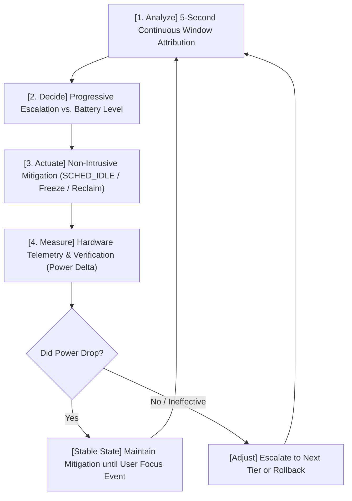

# [REF-RES-009] Linux Desktop Sleep Technologies, Resource Reclamation & Window-Aware Power Suppression

## 1. Executive Summary & Research Motivation
- **Ref-ID**: `REF-RES-009`
- **Module**: `policy::MitigationEngine`, `actuator::CgroupActuator`, `actuator::WindowTracker`
- **Date**: 2026-09-11
- **Focus**: External process suppression mechanisms, kernel interfaces for memory reclamation, desktop window-state tracking, and closed-loop control.

To achieve meaningful battery savings without frustrating the user, a background daemon cannot simply terminate applications. It must master the modern Linux kernel's surgical suppression primitives: **transparent cgroup freezing**, **proactive page reclamation**, **timer slack coalescing**, and **desktop window-state awareness**.

---

## 2. Process Sleep & Freeze Mechanisms: Deep Technical Comparison

### 2.1. Cgroup v2 Freezer (`cgroup.freeze`) vs. POSIX `SIGSTOP` / `SIGCONT`

```text
Feature                  SIGSTOP / SIGCONT                   Cgroup v2 Freezer (cgroup.freeze)
-------------------------------------------------------------------------------------------------
Transparency             Observable (signals, ptrace, shell) 100% Transparent to application
Hierarchy                Single PID or Process Group         Entire cgroup subtree atomically
Parent-Child Safety      Can break job control in shells     Completely safe; no signal handlers fired
Uninterruptible Sleep    Tasks can hang in D-state           Tasks freeze in killable/cancellable state
Kernel Overhead          Signal queue allocation & dispatch  Zero-allocation bitmask flag update
Power Benefit            Removes task from CPU runqueue      Removes task from CPU runqueue & C-states
```

#### Why Cgroup v2 Freezer is Strictly Preferred:
1. **Signal Transparency**: When an application (e.g. Chrome or an IDE) receives `SIGSTOP`, its internal watchdog threads or parent supervisors may assume the child has crashed or hung. Cgroup freezing is completely invisible to userspace code.
2. **Atomic Tree Freezing**: Multi-process applications (e.g. Chrome with 30 worker renderers) can be frozen simultaneously with a single `write("1", cgroup.freeze)`. No race conditions or IPC deadlocks occur between threads.

---

## 3. Kernel Resource Reclamation Primitives

### 3.1. Proactive Memory Reclamation (`memory.reclaim`) — Linux 5.19+
Introduced in kernel 5.19, `/sys/fs/cgroup/<path>/memory.reclaim` allows an unprivileged or daemon controller to trigger memory compaction:
```bash
echo "100M" > /sys/fs/cgroup/user.slice/user-1000.slice/app.slice/.../memory.reclaim
```
- **Physical Battery Impact**: Compacting inactive anonymous pages to zram/swap drops the physical DRAM cell retention charge load ($P_{\text{DRAM}} \propto \text{PSS}$).
- **Zero-Wakeup Compaction**: Operates without waking the target process's CPU cores.

### 3.2. Timer Slack Coalescing (`/proc/[pid]/timerslack_ns`)
Linux kernels allow external processes with `CAP_SYS_NICE` (or root) to adjust timer slack:
- Standard desktop timer slack: `50,000 ns` ($50\mu s$).
- **Suppression Mode**: Setting `timerslack_ns` to `100,000,000 ns` (100 ms) or `500,000,000 ns` (500 ms) forces the kernel timer wheel to coalesce wakeup interrupts with other system timers.
- **Physical Impact**: Eliminates unaligned timer interrupts, directly enabling AMD Zen / Intel cores to stay in deep package C-states ($C2/C3$ or $C6/C10$).

---

## 4. Desktop Window State & Occlusion Detection

### 4.1. KDE Plasma / KWin Architecture
In modern Wayland sessions, KWin manages client states internally:
1. **D-Bus Query**: `org.kde.KWin /KWin org.kde.KWin.supportInformation` exports full window state metadata including `minimized: true` and active virtual desktop numbers.
2. **KWin Scripting**: A lightweight transient script evaluates:
   ```javascript
   workspace.windowList().forEach(w => {
       if (w.minimized && !w.active) {
           // Window is minimized and unfocused -> Candidate for Stage 2/3 suppression
       }
   });
   ```

### 4.2. X11 Fallback (`_NET_WM_STATE_HIDDEN`)
In X11 environments, minimized windows have the `_NET_WM_STATE_HIDDEN` atom set in `_NET_WM_STATE`. Unmapped or iconic windows can be identified in $O(1)$ without X11 server stalling.

---

## 5. Closed-Loop Power Control Architecture

WattCurb implements an automated closed-loop feedback pipeline:



1. **Conservative Default**: Under high battery (> 40%), only background indexers are gently demoted to `SCHED_IDLE`.
2. **Progressive under Low Battery (< 20%)**: Unfocused, minimized GUI applications are frozen and memory-reclaimed.
3. **Instantaneous User Focus Recovery**: Any user interaction (click, window unminimize, hotkey) restores full execution in `< 1ms`.
